# Android example

> This demo is still being improved, please reach out if you have issues or questions. mailto:support@remotivelabs.com, alternatively book a slot via: <https://www.remotivelabs.com/contact>


This demo is built of top of lighting and steering and show bidirectional communication with Android. The goal is for you to be be able to follow a recorded drive through Android and observe the location and speed. You can also adjust the temperature in the Android UI and see that the signals are passed back into the topology.

- IHU connected over SOME/IP running Android with live location source

Notice while the example is showing ECUs possible present in a real vehicle, the signals and implementations are simplified to make the example easy to understand. The goal is not intended to be fully realistic.

## Overview

```mermaid
---
config:
  class:
    hideEmptyMembersBox: true
---
    classDiagram

    namespace SCCM {
        class ECU_Mock_SCCM
        class RemotiveBroker_SCCM
    }

    namespace BCM {
        class Behavioral_Model_BCM
        class RemotiveBroker_BCM
    }

    class DriverCan0 {
        <<CAN bus>>
    }

    namespace DIM {
        class ECU_Mock_DIM
        class RemotiveBroker_DIM
    }

    namespace FLCM {
        class ECU_Mock_FLCM
        class RemotiveBroker_FLCM
    }

    namespace RLCM {
        class ECU_Mock_RLCM
        class RemotiveBroker_RLCM
    }

    namespace GWM {
        class Behavioral_Model_GWM
        class RemotiveBroker_GWM
    }

    namespace ABS {
        class ECU_Mock_ABS
        class RemotiveBroker_ABS
    }

    class ChassisCan0 {
        <<CAN bus>>
    }

    class BodyCan0 {
        <<CAN bus>>
    }

    namespace IHU_with_Android {
        class ECU_Mock_IHU
        class RemotiveBroker_IHU
    }

    namespace TCU {
        class ECU_Mock_TCU
        class RemotiveBroker_TCU
    }

    namespace HVAC {
        class ECU_Mock_HVAC
        class RemotiveBroker_HVAC
    }

    class SOMEIP {
        <<SOMEIP bus>>
    }

    class TopologyBroker

    class Android_Emulator
    class TestSuite
    class Jupyter
    class Webapp
    class Behave

    RemotiveBroker_SCCM -- DriverCan0
    RemotiveBroker_BCM -- DriverCan0
    RemotiveBroker_BCM -- BodyCan0
    RemotiveBroker_DIM -- BodyCan0
    RemotiveBroker_FLCM -- BodyCan0
    RemotiveBroker_RLCM -- BodyCan0
    RemotiveBroker_GWM -- BodyCan0
    RemotiveBroker_GWM -- ChassisCan0
    RemotiveBroker_GWM -- SOMEIP
    RemotiveBroker_IHU -- SOMEIP
    RemotiveBroker_ABS -- ChassisCan0
    RemotiveBroker_TCU -- BodyCan0
    RemotiveBroker_HVAC -- BodyCan0

    ECU_Mock_SCCM -- RemotiveBroker_SCCM
    Behavioral_Model_BCM -- RemotiveBroker_BCM
    ECU_Mock_DIM -- RemotiveBroker_DIM
    ECU_Mock_FLCM -- RemotiveBroker_FLCM
    ECU_Mock_RLCM -- RemotiveBroker_RLCM
    Behavioral_Model_GWM -- RemotiveBroker_GWM
    ECU_Mock_IHU -- RemotiveBroker_IHU
    ECU_Mock_ABS -- RemotiveBroker_ABS
    ECU_Mock_TCU -- RemotiveBroker_TCU
    ECU_Mock_HVAC -- RemotiveBroker_HVAC

    Android_Emulator -- ECU_Mock_IHU

    TestSuite ..> TopologyBroker
    Jupyter ..> TopologyBroker
    Behave ..> TopologyBroker
    Webapp ..> TopologyBroker

    TopologyBroker .. RemotiveBroker_SCCM
    TopologyBroker .. RemotiveBroker_BCM
    TopologyBroker .. RemotiveBroker_DIM
    TopologyBroker .. RemotiveBroker_FLCM
    TopologyBroker .. RemotiveBroker_RLCM
    TopologyBroker .. RemotiveBroker_GWM
    TopologyBroker .. RemotiveBroker_IHU
    TopologyBroker .. RemotiveBroker_ABS
    TopologyBroker .. RemotiveBroker_TCU
    TopologyBroker .. RemotiveBroker_HVAC
    
```



| ECU  | Name                           | Description                                             |
| ---- | ------------------------------ | ------------------------------------------------------- |
| SCCM | Steering Column Control Module | Receives input from steering wheel, pedals and buttons  |
| BCM  | Body Control Module            | Controls vehicle body electronics (lights, locks, etc.) |
| DIM  | Driver Information Module      | Manages instrument cluster and driver displays          |
| FLCM | Front Light Control Module     | Controls front lighting system                          |
| RLCM | Rear Light Control Module      | Controls rear lighting system                           |
| GWM  | Gateway Module                 | Routes communication between different vehicle networks |
| IHU  | Infotainment Head Unit         | Manages infotainment and user interface systems         |
| HVAC | Heating, Ventilation, and Air Conditioning | Recieves temperture control from Android infotainment.   |
| ABS | Anti-lock Braking System        | Provides speed                                   |
| TCU | Telematics Control Unit       | Provides GNSS location                                   |

---

## Host setup

You will need the following tools

- `RemotiveCLI` <https://docs.remotivelabs.com/docs/remotive-cli/installation>
- `RemotieToplogy` <https://docs.remotivelabs.com/docs/remotive-topology/install>
- (Optional) `dockercan` <https://releases.remotivelabs.com/#docker_can/>
- (Optional) `socat` [See Emulator on host](#emulator-on-host)
- (Optional) `Android-Studio` [See Emulator on host](#emulator-on-host)

On Linux, this example requires that you run `dockercan` service on your machine to enable CAN networks in Docker, install the latest version from [here](https://releases.remotivelabs.com/#docker_can/) or read about how to do this over udp in the [documentation](https://docs.remotivelabs.com/docs/remotive-topology/getting-started#can).

Select you recording you like to use as input, navigate to it and extract the session id from the recording url <https://console.cloud.remotivelabs.com/p/my-demo/recordings/9459066702917749000?tab=playback>
Make sure the recording contains `ChassisBus` and `VehicleBus`
e.g. `9459066702917749000` also take note of the project (in this case `my-demo` which is the name which contains "Recordings").

## Android ADB, Vehicle HAL (VHAL) and EMULATOR - how to get going

The example can be run either using an Android emulator running on the host machine or one running within the docker environment. The easiest way to get started is by running the emulator within docker as it requires far less setup. For running the emulator on the host the instructions will differ based on your platform.

> :warning: When running the emulator within Docker it requires hardware virtualisation using KVM to achieve any reasonable performance. This means that running the example in this configuration is limited to Linux only using x86_64 architecture.

### Emulator within Docker

To run the Google Maps application in the Android emulator it first needs to be installed. This is done during topology startup but it requires the APK to be provided during build. Download the APK, e.g. from <https://www.apkmirror.com/apk/google-inc/google-maps-android-automotive/>, and place it in the `android/containers/android_emulator/` folder.

Generate the topology

  ```
  remotive-topology generate \
  -f android/topology/main.instance.yaml \
  -f android/topology/ihu_with_emulator_in_compose.instance.yaml \
  android/build -n android
```

Start the cloud playback, and start the topology, from the root of this repository. Unless already signed in start by doing `remotive cloud auth login`

```
# check above on how to extract you session id.
export CLOUD_URL=$(./android/run.sh my-demo 9459066702917749000)
CLOUD_AUTH=$(remotive cloud auth print-access-token) \
docker compose -f android/build/android/docker-compose.yml --profile jupyter --profile ui --profile cloudfeeder up
```

You should then be able to reach the emulator by going to <http://localhost:8085/vnc.html> and connecting. The first time it starts you will have to configure some settings and permission for the maps application.

You can also visit the RemotiveBroker Webapp at <http://localhost:8080> to observe the temperature signals being send back from the Android Emulator.

### Emulator on host

If you are not running on Linux or want more control of what to run within the emulator you can also use this example together with a local emulator, see [Emulator on host](EMULATOR_ON_HOST.md)

## Configuration

All configuration is done using RemotiveTopology instance files:

> :link: [Main instance](topology/main.instance.yaml)<br>
> :link: [Windows/MacOS configuration](topology/can_over_udp.instance.yaml)
> :link: [IHU with containerized emulator](topology/ihu_with_emulator_in_compose.instance.yaml)
> :link: [IHU with host emulator](topology/ihu_with_emulator_on_host.instance.yaml)

Notice how the main instance includes other instance configuration files and also the platform configuration. RemotiveTopology is based around a modular approach to describe both platforms and different ways to instantiate them. For example in this example you can see how Jupyter notebook is defined in a [reusable instance file](topology/jupyter.instance.yaml).

### ECU implementations (Behavioral models)

The `BCM`, `GWM` and `IHU` ECUs are behavioral models, which means that they contain custom logic. The source code for there ECUs can be found in:

> :link: [ecus/bcm](ecus/bcm)  
> :link: [ecus/gwm](ecus/gwm)  
> :link: [ecus/ihu](ecus/ihu)  

To showcase ECU extracts, the `GWM` ECU is configured with its own `interfaces.json` and databases:

> :link: [ecus/gwm/configuration/interfaces.json](ecus/gwm/configuration/interfaces.json)  
> :link: [ecus/gwm/configuration/dbs/gwm_body_can.dbc](ecus/gwm/configuration/dbs/gwm_body_can.dbc)  

### Docker compose file

RemotiveTopology uses Docker compose to define the containers and networks of the topology. The compose file is generated, but can be found in the project root:

> :link: [docker-compose.yml](build/android/docker-compose.yml)

### Test suite

The test suite is implemented using the RemotiveLabs ECU framework. The source code for the test suite can be found in:

> :link: [containers/tester/](containers/tester/)

```bash
docker compose -f android/build/android/docker-compose.yml --profile tester up --abort-on-container-exit
```

### Behave + Gherkin

Execute the Gherkin scenarios found ub [containers/behave/features/blink_left.feature](containers/behave/features/blink_left.feature) with the command below.

```bash
docker compose -f android/build/android/docker-compose.yml --profile behave up --abort-on-container-exit
```

### Jupyter

Jupyter allows you to interact with the input ECUs using a graphical interface:

```bash
docker compose -f android/build/android/docker-compose.yml --profile jupyter up
```

and then browse to [http://localhost:8888/lab?token=remotivelabs](http://localhost:8888/lab?token=remotivelabs).

### RemotiveBroker Webapp

All the traffic moving through the busses can be observed with the web-app. Specify that you want to run with the `ui` profile.

```bash
docker compose -f android/build/android/docker-compose.yml --profile ui up
```

Browse to [http://localhost:8080](http://localhost:8080) and select the signals you like to monitor.

## Running unit tests

It is important to test early, and local unit/integration tests are important tools to achieve this. This example shows how to install and run the unit tests for the `bcm` ECU located in [tests](./tests) using [setuptools and a local venv](http://packaging.python.org/en/latest/tutorials/installing-packages/).

```bash
# create and activate virtualenv
python -m venv .venv
source .venv/bin/activate

# update pip/setuptools
pip install --upgrade pip setuptools wheel

# install project and its dependencies
pip install -e .

# run unit tests
python -m pytest
```
