# Android example

> This demo is still being improved, please reach out if you have issues or questions. mailto:support@remotivelabs.com, alternatively book a slot via: https://www.remotivelabs.com/contact


This demo is built of top of lighting and steering and show bidirectional communication with Android.

- IHU connected over SOME/IP runnind Android with live location source

Notice while the example is showing ECUs possible present in a real vehicle, the signals and implementations are simplified to make the example easy to understand. The goal is not intended to be fully realistic.

## Overview

```mermaid
---
config:
  class:
    hideEmptyMembersBox: true
---
    classDiagram

    namespace SCCM {
        class ECU_Mock_SCCM
        class RemotiveBroker_SCCM
    }

    namespace BCM {
        class Behavioral_Model_BCM
        class RemotiveBroker_BCM
    }

    class DriverCan0 {
        <<CAN bus>>
    }

    namespace DIM {
        class ECU_Mock_DIM
        class RemotiveBroker_DIM
    }

    namespace FLCM {
        class ECU_Mock_FLCM
        class RemotiveBroker_FLCM
    }

    namespace RLCM {
        class ECU_Mock_RLCM
        class RemotiveBroker_RLCM
    }

    namespace GWM {
        class Behavioral_Model_GWM
        class RemotiveBroker_GWM
    }

    namespace ABS_ECU {
        class ECU_Mock_ABS_ECU
        class RemotiveBroker_ABS_ECU
    }

    class ChassisCan {
        <<CAN bus>>
    }

    class BodyCan0 {
        <<CAN bus>>
    }

    namespace IHU_with_Android {
        class ECU_Mock_IHU
        class RemotiveBroker_IHU
    }

    namespace TCU {
        class ECU_Mock_TCU
        class RemotiveBroker_TCU
    }

    namespace HVAC {
        class ECU_Mock_HVAC
        class RemotiveBroker_HVAC
    }

    class SOMEIP {
        <<SOMEIP bus>>
    }

    class TopologyBroker

    class TestSuite
    class Jupyter
    class Webapp
    class Behave

    RemotiveBroker_SCCM -- DriverCan0
    RemotiveBroker_BCM -- DriverCan0
    RemotiveBroker_BCM -- BodyCan0
    RemotiveBroker_DIM -- BodyCan0
    RemotiveBroker_FLCM -- BodyCan0
    RemotiveBroker_RLCM -- BodyCan0
    RemotiveBroker_GWM -- BodyCan0
    RemotiveBroker_GWM -- ChassisCan0
    RemotiveBroker_GWM -- SOMEIP
    RemotiveBroker_IHU -- SOMEIP
    RemotiveBroker_ABS_ECU -- ChassisCan0
    RemotiveBroker_TCU -- BodyCan0
    RemotiveBroker_HVAC -- BodyCan0

    ECU_Mock_SCCM -- RemotiveBroker_SCCM
    Behavioral_Model_BCM -- RemotiveBroker_BCM
    ECU_Mock_DIM -- RemotiveBroker_DIM
    ECU_Mock_FLCM -- RemotiveBroker_FLCM
    ECU_Mock_RLCM -- RemotiveBroker_RLCM
    Behavioral_Model_GWM -- RemotiveBroker_GWM
    ECU_Mock_IHU -- RemotiveBroker_IHU
    ECU_Mock_ABS_ECU -- RemotiveBroker_ABS_ECU
    ECU_Mock_TCU -- RemotiveBroker_TCU
    ECU_Mock_HVAC -- RemotiveBroker_HVAC

    TestSuite ..> TopologyBroker
    Jupyter ..> TopologyBroker
    Behave ..> TopologyBroker
    Webapp ..> TopologyBroker

    TopologyBroker .. RemotiveBroker_SCCM
    TopologyBroker .. RemotiveBroker_BCM
    TopologyBroker .. RemotiveBroker_DIM
    TopologyBroker .. RemotiveBroker_FLCM
    TopologyBroker .. RemotiveBroker_RLCM
    TopologyBroker .. RemotiveBroker_GWM
    TopologyBroker .. RemotiveBroker_IHU
    TopologyBroker .. RemotiveBroker_ABS_ECU
    TopologyBroker .. RemotiveBroker_TCU
    TopologyBroker .. RemotiveBroker_HVAC
    
```



| ECU  | Name                           | Description                                             |
| ---- | ------------------------------ | ------------------------------------------------------- |
| SCCM | Steering Column Control Module | Receives input from steering wheel, pedals and buttons  |
| BCM  | Body Control Module            | Controls vehicle body electronics (lights, locks, etc.) |
| DIM  | Driver Information Module      | Manages instrument cluster and driver displays          |
| FLCM | Front Light Control Module     | Controls front lighting system                          |
| RLCM | Rear Light Control Module      | Controls rear lighting system                           |
| GWM  | Gateway Module                 | Routes communication between different vehicle networks |
| IHU  | Infotainment Head Unit         | Manages infotainment and user interface systems         |
| HVAC | Heating, Ventilation, and Air Conditioning | Recieves temperture control from Anroid infotainment.   |
| ABS_ECU | Anti-lock Braking System Electronic Control Unit        | Provides GNSS location                                   |
| TCU | Telematics Control Unit       | Provides GNSS location                                   |

---

## Host setup

On Linux, this example requires that you run `dockercan` service on your machine to enable CAN networks in Docker, install the latest version from [here](https://releases.remotivelabs.com/#docker_can/) or read about how to do this over udp in the [documentation](https://docs.remotivelabs.com/docs/remotive-topology/getting-started#can).

## Android ADB, Vehicle HAL (VHAL) and EMULATOR - how to get going

### Install 
- `Android Studio` and create a AVD, make sure it a `userdebug` build which can be started in `permissive` mode. In this demo the AVD is based on `Android Automotive 13 "Tiramisu" with Google APIs ARM 64 v8a System Image`, which comes with `VHAL`. Install a maps apk, eg https://www.apkmirror.com/apk/google-inc/google-maps-android-automotive/.
- `RemotiveCLI` https://docs.remotivelabs.com/docs/remotive-cli/installation
- `RemotieToplogy` https://docs.remotivelabs.com/docs/remotive-topology/install
```
# linux
sudo apt install jq socat
```
```
# MacOS
brew install jq socat
```

Select you recording you like to use as input, navigate to it and extract the session id from the recording url https://console.cloud.remotivelabs.com/p/my-demo/recordings/9459066702917749000?tab=playback
Make sure the recording contains `ChassisBus` and `VehicleBus`
eg `9459066702917749000` also take note of the project (in this case `my-demo` which is the name which contains "Recordings").


## Linux with socketcan, MacOS and Windows without socketcan

1. In terminal A: 
    ```
    adb kill-server
    adb -a -P 5038 nodaemon server start
    ```
2. In terminal B:
    ```
    socat TCP-LISTEN:6000,fork,reuseaddr TCP:localhost:5554
    ```
3. In terminal C:
    Start your android emulator
    ```
    ANDROID_ADB_SERVER_PORT=5038 ~/Library/Android/sdk/emulator.backup/emulator @Tiramisu_API_33_automotive -selinux permissive -no-snapshot
    ```
4. In terminal D:    
    - Linux: Generate the topology (with socketcan), from the root of this repository.
        ```
        remotive-topology generate \
        -f android/topology/main.instance.yaml \
        android/build -n android
        ```
    - MacOS and Windows: Generate the topology (without socketcan), from the root of this repository.
        ```
        remotive-topology generate \
        -f android/topology/main.instance.yaml \
        -f android/topology/can_over_udp.instance.yaml \
        android/build -n android
        ```
5. Start the cloud playback, and start the topology, from the root of this repository.
    Unless already signed in start by doing `remotive cloud auth login`
    ```
    # check above on how to extract you session id.
    export CLOUD_URL=$(./android/run.sh my-demo 9459066702917749000)
    CLOUD_AUTH=$(remotive cloud auth print-access-token) \
    ANDROID_EMULATOR_AUTH=$(cat ~/.emulator_console_auth_token) \
    docker compose -f android/build/android/docker-compose.yml --profile jupyter --profile ui --profile cloudfeeder up    
    ```
5. Navigation starts now, observe speed and location.


## Windows and MacOS combined with a (virtual) linux, which enables `socketcan`

1. connect to your `linux`
    ```
    ssh user@192.168.64.3 -L 50051:localhost:50051 -L 8080:localhost:8080 -L 8081:localhost:8081 -L 8888:localhost:8888 -L 5001:localhost:5001 -R 5555:localhost:5555 -R 15554:localhost:5554
    ```
    make sure that the `~/.emulator_console_auth_token` does exits, if you are in a VM you need to copy the file from the host where the emulator is running.

1. In terminal A on `linux`: 
    ```
    adb kill-server
    adb -a -P 5038 nodaemon server start
    ```
2. In terminal B on `linux`:
    ```
    socat TCP-LISTEN:6000,fork,reuseaddr TCP:localhost:15554
    ```
3. In terminal on `host`:
    Start your android emulator
    ```
    ANDROID_ADB_SERVER_PORT=5038 ~/Library/Android/sdk/emulator.backup/emulator @Tiramisu_API_33_automotive -selinux permissive -no-snapshot
    ```
4. In terminal C on `linux`:    
    - Linux: Generate the topology (with socketcan), from the root of this repository.
        ```
        remotive-topology generate \
        -f android/topology/main.instance.yaml \
        android/build -n android
        ```
5. Start the cloud playback, and start the topology, from the root of this repository.
    Unless already signed in start by doing `remotive cloud auth login`
    ```
    # check above on how to extract you session id.
    export CLOUD_URL=$(./android/run.sh my-demo 9459066702917749000)
    CLOUD_AUTH=$(remotive cloud auth print-access-token) \
    ANDROID_EMULATOR_AUTH=$(cat ~/.emulator_console_auth_token) \
    docker compose -f android/build/android/docker-compose.yml --profile jupyter --profile ui --profile cloudfeeder up    
    ```
5. Navigation starts now, observe speed and location.

# Hints

- `adb` commands can be run as normal, however `-P 5038` needs to be appended, such as `adb -P 5038 logcat`, alternatively `ANDROID_ADB_SERVER_PORT=5038 adb logcat`
- `run.sh` scripts (above) returns and logs your cloud broker. When you seek you Android location will be updated acordingly.
- wireshark and edgeshark is very useful in this setup https://docs.remotivelabs.com/docs/remotive-topology/tools/wireshark


# Troubleshooting

- Make sure that the adb server is running before the emulator is started
- Make sure there is only one one adb server
- Make sure there is only one emulator runnning
- Make sure that Android studio is not running. Read more in Emulator section.
- If the stream stops it probably reached end of drive. Check **Hints** above.

#### Emulator
There is no way simple way to start android in `permissive` mode which is required for VHAL and custom properties. If you only need `emu` support and still like to launch from Android Studio, then make sure to change adb port. Located in Debugger options, use port 5038.

> Hint: If you launch from command line, you can still connect your emulator.

#### VHAL properties
make sure to **BOOT** in permissive mode
```
 ANDROID_ADB_SERVER_PORT=5038 ~/Library/Android/sdk/emulator.backup/emulator @SmallAutoAPI33 -selinux permissive -no-snapshot
```
check vhal
```
adb shell setenforce 0
adb shell getenforce
# Should return: Permissive
adb logcat | grep "Vehicle"
adb shell lsof -iTCP -sTCP:LISTEN 
# make sure you see port 33452 or 9342 (this project is set prebuilt fgr 33452) 
```


### Useful resources
- https://developer.android.com/tools/adb
- https://twosixtech.com/blog/integrating-docker-and-adb/?utm_source=chatgpt.com
- https://stackoverflow.com/questions/46898322/emulator-5554-unauthorized-for-adb-devices

## Configuration

All configuration is done using RemotiveTopology instance files:

> :link: [Main instance](topology/main.instance.yaml)<br>
> :link: [Windows/MacOS configuration](topology/can_over_udp.instance.yaml)

Notice how the main instance includes other instance configuration files and also the platform configuration. RemotiveTopology is based around a modular approach to describe both platforms and different ways to instantiate them. For example in this example you can see how Jupyter notebook is defined in a [reusable instanstance file](topology/jupyter.instance.yaml).

### ECU implementations (Behavioral models)

The `BCM` and `GWM` ECUs are behavioral models, which means that they contain custom logic. The source code for there ECUs can be found in:

> :link: [ecus/bcm](ecus/bcm)<br>
> :link: [ecus/gwm](ecus/gwm)

To showcase ECU extracts, the `GWM` ECU is configured with its own `interfaces.json` and databases:

> :link: [ecus/gwm/configuration/interfaces.json](ecus/gwm/configuration/interfaces.json)<br>
> :link: [ecus/gwm/configuration/dbs/gwm_body_can.dbc](ecus/gwm/configuration/dbs/gwm_body_can.dbc)

### Docker compose file

RemotiveTopology uses Docker compose to define the containers and networks of the topology. The compose file is generated, but can be found in the project root:

> :link: [docker-compose.yml](build/android/docker-compose.yml)

### Test suite

The test suite is implemented using the RemotiveLabs ECU framework. The source code for the test suite can be found in:

> :link: [containers/tester/](containers/tester/)

```bash
docker compose -f android/build/android/docker-compose.yml --profile tester up --abort-on-container-exit
```

### Behave + Gherkin

Execute the Gherkin scenarios found ub [containers/behave/features/blink_left.feature](containers/behave/features/blink_left.feature) with the command below.

```bash
docker compose -f android/build/android/docker-compose.yml --profile behave up --abort-on-container-exit
```

### Jupyter

Jupyter allows you to interact with the input ECUs using a graphical interface:

```bash
docker compose -f android/build/android/docker-compose.yml --profile jupyter up
```

and then browse to [http://localhost:8888/lab?token=remotivelabs](http://localhost:8888/lab?token=remotivelabs).

### RemotiveBroker Webapp

All the traffic moving through the busses can be observed with the web-app. Specify that you want to run with the `ui` profile.

```bash
docker compose -f android/build/android/docker-compose.yml --profile ui up
```

Browse to [http://localhost:8080](http://localhost:8080) and select the signals you like to monitor.

## Running unit tests

It is important to test early, and local unit/integration tests are important tools to achieve this. This example shows how to install and run the unit tests for the `bcm` ECU located in [tests](./tests) using [setuptools and a local venv](http://packaging.python.org/en/latest/tutorials/installing-packages/).

```bash
# create and activate virtualenv
python -m venv .venv
source .venv/bin/activate

# update pip/setuptools
pip install --upgrade pip setuptools wheel

# install project and its dependencies
pip install -e .

# run unit tests
python -m pytest
```
