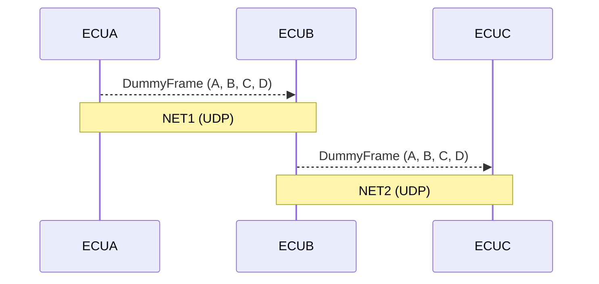
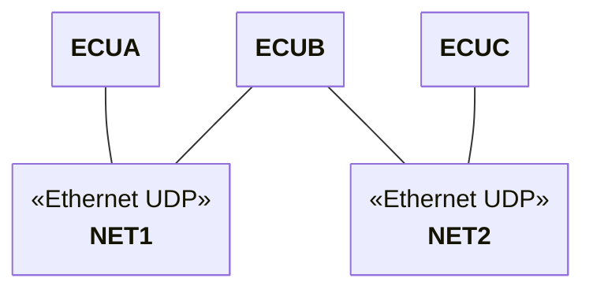

# Ethernet peer-to-peer validation

This examples demonstrates how to configure and validate ECUs that communicate using Ethernet peer to peer. It also shows how the same tests can be reused as the device under test matures from being a behavioral model, to a container based simulation to an external hardware component.

The example is structured as three ECUS (ECUA, ECUB, ECUC) that communicate over two different Ethernet networks. `ECUB` acts as a gateway that forwards the frames received from `ECUA` on `NET1` to `ECUC` on `NET2`. The goal is to verify that the `ECUB` outputs the correct frames.



The example comes with **three instance configurations** for `ECUB`:

- **Behavioral model** implemented with the RemotiveTopology `BehavioralModel` framework
- **Container** a plain Python UDP socket script with no framework dependency
- **External** the same Python script that is run outside of the docker environment to simulate an external hardware component

## Describe the platform

The platform is defined in [`platform/network.platform.yaml`](platform/network.platform.yaml). It describes two isolated Ethernet channels and the UDP socket connections between ECUs on each channel:

`ECUB` appears on both channels — it owns an endpoint on `NET1` (receiving from `ECUA`) and an
endpoint on `NET2` (sending to `ECUC`).



## Three ECUB implementations

All three instance files mock `ECUA` and run `ECUC` as a simple broker. This allows test signals to be injected into `ECUA`. The only difference is how `ECUB` is deployed.

### Behavioral model — `instances/model.instance.yaml`

`ECUB` runs as a RemotiveTopology [`BehavioralModel`](ecub_model/src/__main__.py). It subscribes to incoming frames on `NET1` via a `CanNamespace` and updates the `NET2` restbus whenever a `DummyFrame` arrives:

```python
async def on_frame(self, frame: Frame) -> None:
    await self.net_2.restbus.update_signals(
        ("DummyFrame.A", frame.signals.get("DummyFrame.A") or 0),
        ("DummyFrame.B", frame.signals.get("DummyFrame.B") or 0),
        ("DummyFrame.C", frame.signals.get("DummyFrame.C") or 0),
        ("DummyFrame.D", frame.signals.get("DummyFrame.D") or 0),
    )
```

The instance file wires the model into the topology:

```yaml
ecus:
  ECUA:
    mock: {}

  ECUB:
    models:
      ecub:
        type: container
        container:
          build:
            target: model
            dockerfile: ../ecub_model/Dockerfile
          command: python -m src

  ECUC: {}
```

### Container — `instances/container.instance.yaml`

`ECUB` runs as a plain Python container ([`ecub_container/ecub.py`](ecub_container/ecub.py)) that opens two UDP sockets and forwards raw  datagrams from `NET1` to `NET2`. No RemotiveTopology framework is required, this shows how any language or runtime can act as a gateway ECU.

```yaml
ecus:
  ECUA:
    mock: {}

  ECUB:
    container:
      image: python:3.11-slim
      working_dir: /app
      volumes:
        - ../ecub_container:/app
      command: ./ecub.py

  ECUC: {}
```

### External — `instances/external.instance.yaml`

`ECUB` is declared as `external`, meaning that the ECU is expected to be present but not managed by the RemotiveTopology platform. This could mean either running outside of docker in another runtime as a hardware component connected to the Ethernet networks.

```yaml
ecus:
  ECUA:
    mock: {}

  ECUB:
    external: {}

  ECUC: {}
```

## Creating a reusable test

A key point of this example is that the same test should be able to run no matter if the `ECUB` is a behavioral model or a hardware component. This is achieved by attaching a TAP configuration to the networks as seen in the instance files.

```yaml
NET1:
  type: ethernet
  tap_config:
    type: socket
    mode: all
```

This ensures that when the topology starts, the Linux network stack is configured so that we can observe the networks and validate the data using the RemotiveTopology testing framework. To use the TAP configuration in our tests we simply prefix the ECU namespace with `tap_` as `tap_ECUB-ecu_b_net_2_socket-ecu_c_net_2_socket-NET2` and write assertions as normal.

## Running the example

### Generate and start

Pick one of the three instance files and generate the runtime environment:

```sh
# model
remotive topology generate -f ethernet_p2p/instances/model.instance.yaml build

# container
remotive topology generate -f ethernet_p2p/instances/container.instance.yaml build

# external
remotive topology generate -f ethernet_p2p/instances/external.instance.yaml build
```

Then start the topology:

```sh
# model
docker compose -f build/ethernet-p2p-model/docker-compose.yml up --build

# container
docker compose -f build/ethernet-p2p-container/docker-compose.yml up --build

# external
docker compose -f build/ethernet-p2p-external/docker-compose.yml up --build -d
sudo ip addr add 172.40.0.2/24 dev net1
sudo ip addr add 172.41.0.1/24 dev net2
./ethernet_p2p/ecub_standalone/ecub.py
```

### Run the tests

With the topology running, open a second terminal and run the integration tests from the `tests/`
directory:

```sh
cd ethernet_p2p/tests
uv run pytest -s -vv
```

The test sets signals `A=1, B=2, C=3, D=4` on `ECUA`'s mock restbus, then subscribes to the tap
channel on `ECUB`'s `NET2` output and asserts the same values arrive within 2 seconds.

Once you are done, clean up the Docker resources:

```sh
docker compose -f build/ethernet-p2p-model/docker-compose.yml down
```
