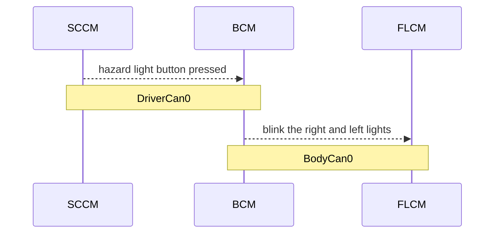
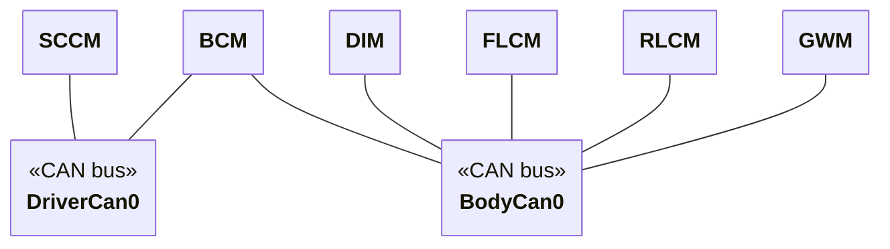
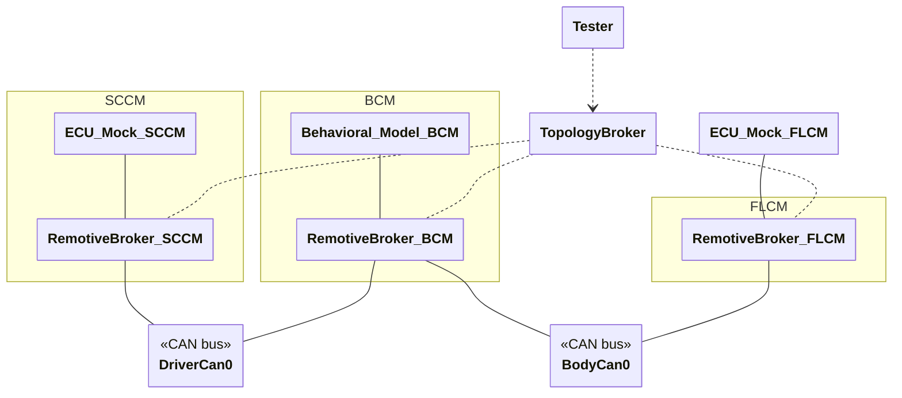

# Getting started example

Check out [prerequisites](#Prerequisites) if you have not already installed necessary tools.

In this example, the goal is to write a test that verifies whether the front light control module (`FLCM`) receives the correct signal when the hazard lights button is pressed. Pressing the hazard lights button triggers the Steering Column Control Module (`SCCM`) to send a message to the body control module (`BCM`), which contains the logic for forwarding the correct information to the light control modules.



To achieve this:

- Describe the platform
- Write a behavioral model
- Describe how to instantiate the model
- Write test case that controls mocks for the `HLCU` and `FLCM`, to simulate inputs and outputs
- Configure shared settings
- Run the test case using Docker

## Describe the platform

The first steps when describing the platform is collecting all the information you already have. This can include signaldatabases such as DBC or complete ARXML files. In this example a DBC file is used as it's fairly easy to understand.

Here is an extract from `driver_can.dbc`:

```
BO_ 100 HazardLightButton: 1 SCCM
 SG_ HazardLightButton : 0|1@1+ (1,0) [0|1] ""  BCM
```

This includes quite a lot of information but from RemotiveTopology perspective it tells you:

- `SCCM` is sending a CAN Frame called HazardLightButton
- `BCM` is receiving this frame and reads the signal HazardLightButton (on/off)

In fact, given this information RemotiveTopology understands that there exists two ECUs `SCCM` and `BCM` that are communicating on a CAN channel.

Similarly, given this extract from `driver_can.dbc`:

```
BO_ 103 TurnLightControl: 1 BCM
  SG_ LeftTurnLightRequest : 0|1@1+ (1,0) [0|1] ""  DIM, FLCM, RLCM, GWM
  SG_ RightTurnLightRequest : 1|1@1+ (1,0) [0|1] ""  DIM, FLCM, RLCM, GWM
```

RemotiveTopology now understands that there exists 4 other ECUs `DIM`, `FLCM`, `RLCM`, `GWM` that also communicate with `BCM`.

Since the DBC files doesn't include information about what the CAN channels are called you need to add additional information using a RemotiveTopology platform.yaml file:

```yaml
schema: remotive-topology-platform:0.7
channels:
  DriverCan0:
    type: can
    database: ../databases/driver_can.dbc
    can_physical_channel_name: DriverCan0

  BodyCan0:
    type: can
    database: ../databases/body_can.dbc
    can_physical_channel_name: BodyCan0
```

This tells RemotiveTopology the following:

- This is a `remotive-topology-platform` file
- There exist two CAN channels DriverCan0 and BodyCan0
- driver_can.dbc can be used to decode signals on DriverCan0
- body_can.dbc can be used to decode signals on BodyCan0

RemotiveTopology automatically loads the DBC files and now understands what ECUs exists in the topology.



This is all the information you need for the platform!

## A Behavioral model for the `BCM`

The next step is to create a Behavioral Model, which can be found [here](./ecus/bcm/__main__.py).

While being a simplified example, the structure is common to most kinds of behavioral models. This tutorial goes through everything in more detail, but note a few things:

- There are two main parts, the model logic and the main setup code.
- The file runs as a program and some information from the topology instance is passed in as command line parameters. There is a ready utility class, `BehavioralModelArgs`, to parse these into a data class.
- The broker connection is managed with `BrokerClient`.
- There are two `CanNamespace`, one to configure inputs and one to configure a restbus. These handle the actual network traffic and information from the signal databases for a given namespace.
- The runtime is driven by a `BehavioralModel`. This is a central class for behavioral models. It routes inputs to provided callbacks and handles control messages.
- The logic of the model is in the `BCM` class. Representing the model as a class creates a nice encapsulation.

## Instantiate the `BCM` model

In RemotiveTopology you create a topology by combining one or more instance.yaml files. Each file can contain one or more ECUs or other settings. In this case you need to instantiate the Behavioral Model for the `BCM` ECU:

```yaml
schema: remotive-topology-instance:0.7

ecus:
  BCM:
    models:
      bcm:
        type: container
        container:
          build:
            dockerfile: ../Dockerfile
          volumes:
            - ../ecus/bcm:/app/bcm
          working_dir: /app
          command: python -m bcm
```

This tells RemotiveTopology the following:
- This is a `remotive-topology-instance` file
- Instantiate the ECU `BCM` and start a behavioral model called `bcm`. This is written in a python module called `bcm`

The file structure should now look like this:

Try viewing the resulting topology:

```sh
$ remotive-topology show topology --resolve getting_started/topology/main.instance.yaml
```

This shows:

```yaml
---
channels:
  BodyCan0:
    driver:
      device_name: bodycan0
      peer: bodycan0
      type: dockercan
    type: can
  DriverCan0:
    driver:
      device_name: drivercan0
      peer: drivercan0
      type: dockercan
    type: can
containers:
  tester:
    build:
      dockerfile: <path>/getting_started/Dockerfile
    command: pytest --broker_url=http://topology-broker.com:50051 -s -vv
    control_network: true
    depends_on:
      - FLCM-broker.com
    profiles:
      - tester
    volumes:
      - <path>/getting_started/tests:/app
    working_dir: /app
ecus:
  BCM:
    channels:
      BodyCan0:
      DriverCan0:
    models:
      bcm:
        container:
          build:
            dockerfile: <path>/getting_started/Dockerfile
          command: python -m bcm
          control_network: true
          volumes:
            - <path>/getting_started/ecus/bcm:/app/bcm
          working_dir: /app
        type: container
  FLCM:
    channels:
      BodyCan0:
  SCCM:
    channels:
      DriverCan0:
    mock:
      channels: {}
includes:
  - <path>/getting_started/topology/bcm.instance.yaml
  - <path>/getting_started/topology/settings.instance.yaml
  - <path>/getting_started/topology/tester.instance.yaml
platform:
  channels:
    BodyCan0:
      can_physical_channel_name: BodyCan0
      database: <path>/getting_started/databases/body_can.dbc
      source:
        - <path>/getting_started/topology/topology.platform.yaml
      type: can
    DriverCan0:
      can_physical_channel_name: DriverCan0
      database: <path>/getting_started/databases/driver_can.dbc
      source:
        - <path>/getting_started/topology/topology.platform.yaml
      type: can
  ecus:
    BCM:
      channels:
        BodyCan0:
        DriverCan0:
      source:
        - <path>/getting_started/databases/body_can.dbc
        - <path>/getting_started/databases/driver_can.dbc
    FLCM:
      channels:
        BodyCan0:
      source:
        - <path>/getting_started/databases/body_can.dbc
    SCCM:
      channels:
        DriverCan0:
      source:
        - <path>/getting_started/databases/driver_can.dbc
schema: remotive-topology-instance:0.7
settings:
  remotivebroker:
    license_file: <path>/REMOTIVEBROKER_LICENSE
    version: v1.10.3
  topology_broker:
    channels: {}
  ui:
    port: 8080
    profile: ui
```

Notice:
- Only ECUs included in the instance are visible in the resolved platform, in this case `BCM`, `FLCM` and `SCCM`. The platform also includes channels that are either included in the instance or used by the included ECUs.

## Writing a test case

A minimal test case that checks that the lights turn on when pressing the hazard light button can be found [here](./tests/test_hazard_light.py)

These tests are added in the topology with an instance file like:

```yaml
schema: remotive-topology-instance:0.7

containers:
  tester:
    profiles: [tester]
    build:
      dockerfile: ../Dockerfile
    volumes:
      - ../tests:/app
    working_dir: /app
    command: "pytest --broker_url=http://topology-broker.com:50051 -s -vv"
    depends_on:
      - FLCM-broker.com

ecus:
  FLCM: {}

  SCCM:
    mock: {}
```

Notice:
- Tests are running inside a generic docker container. You can use whatever framework you want!
- Tests are using a profile which means they're optional when running the instance.
- Since the tests are written using a mock, the mock need to be instantiated.

## Settings

Before running the tests it's necessary to define some settings for how to instantiate the topology. These settings can potentially be used across all topology instances:

```yaml
schema: remotive-topology-instance:0.7

settings:
  remotivebroker:
    version: v1.10.3
    license_file: ../../REMOTIVEBROKER_LICENSE
```

This tells RemotiveTopology:
- version of RemotiveBroker to use. Recommendation: specify version to ensure that tests are run using the exact same behavior over time.
- Where your RemotiveTopology license is located.

### CAN

RemotiveTopology supports two ways of instantiating a CAN network:

1. [RemotiveLabs DockerCAN](https://releases.remotivelabs.com/#docker_can/) driver for SocketCAN (default)
2. Emulation using UDP (by broadcasting ethernet PDUs)

DockerCAN is needed to connect to physical hardware and to use standard CAN tooling such as `candump`. DockerCAN using SocketCAN is the natural way to implement CAN and is therefore the default setting in RemotiveTopology.

:warning: SocketCAN is only supported on Linux with [RemotiveLabs DockerCAN](https://releases.remotivelabs.com/#docker_can/) driver. On Mac/Windows you need to fall back to emulation. Notice that the UDP packets are still encoded in the same way as the real CAN frames, by using ethernet PDUs.

To make this example run on all platforms use CAN over UDP. This is configured by adding the following instance.yaml:

```yaml
schema: remotive-topology-instance:0.7

settings:
  can:
    default_driver: udp
```

## Running the tests

Tests need to be configured in what environment they should run. This is done using yet another instance.yaml:

```yaml
schema: remotive-topology-instance:0.7

includes:
  - ./bcm.instance.yaml
  - ./tester.instance.yaml
  - ./settings.instance.yaml

platform:
  includes:
    - ./topology.platform.yaml
```

This tells RemotiveTopology:
- instantiate the `bcm` behavioral model
- what tests to run
- use shared settings
- settings to run over udp
- platform information

Notice:
- By explicitly including all the dependencies this ensures that the tests run in the environment you intend.
- Since in this case you are testing a behavioral model and not real ECU software or hardware, you can use CAN emulation.
- You can easily run the same tests using real hardware simply by replacing the `bcm` instance and configuring CAN devices instead of emulation.

To run the topology generate the runtime environment:

```sh
$ remotive-topology generate -f getting_started/topology/main.instance.yaml -f getting_started/topology/can_over_udp.instance.yaml --name getting_started build
Generated topology at: build/getting_started
$ docker compose -f build/getting_started/docker-compose.yml --profile tester up --abort-on-container-exit
```

You can run the tests several times. Once you are done, you should clean up the docker resources:

```sh
docker compose -f build/getting_started/docker-compose.yml --profile tester down
```

### Resulting topology

This is the topology you created in this example:




## Steps forward

There are several ways of moving forward from what you have here:

1. You can add more ECUs that are involved by turn signals. The signal stalk ECU, the infotainment console, etc. Since these models are sending real network traffic, it's possible to verify that the correct data is sent to the correct endpoints.
2. By adding more test cases, you can create a test suite that verifies that all the parts in the topology work together.
3. The included ECUs can be "upgraded" to higher fidelity models, such as an FMU or Synopsis Silver. It's even possible to use real hardware in the topology as long as everything is running on the correct networks.

## Prerequisites

Before running the example, ensure the following software is installed on your system:

- **Remotive Topology CLI**
  ➤ [Installation instructions](https://docs.remotivelabs.com/docs/remotive-topology/install)

- **Docker**
  ➤ [Learn more about Docker](https://www.docker.com/)
