# Lighting and steering example

The purpose of the example is to show a somewhat realistic topology where multiple ECUs communicate over two CAN buses and a SOME/IP network. This includes:

- `BehavioralModel` in python
- `ECUMock`
- Testcases with pytest
- Testcases with behave
- Jupyter notebook
- CAN communiation over UDP or CAN
- SOME/IP
- How to structure a more complex topology

Notice while the example is showing ECUs possible present in a real vehicle, the signals and implementations are simplified to make the example easy to understand. The goal is not intended to be fully realistic.

## Overview

```mermaid
---
config:
  class:
    hideEmptyMembersBox: true
---
    classDiagram

    namespace SCCM {
        class ECU_Mock_SCCM
        class RemotiveBroker_SCCM
    }

    namespace BCM {
        class Behavioral_Model_BCM
        class RemotiveBroker_BCM
    }

    class DriverCan0 {
        <<CAN bus>>
    }

    namespace DIM {
        class ECU_Mock_DIM
        class RemotiveBroker_DIM
    }

    namespace FLCM {
        class ECU_Mock_FLCM
        class RemotiveBroker_FLCM
    }

    namespace RLCM {
        class ECU_Mock_RLCM
        class RemotiveBroker_RLCM
    }

    namespace RL {
        class ECU_Mock_RL
        class RemotiveBroker_RL
    }

    namespace GWM {
        class Behavioral_Model_GWM
        class RemotiveBroker_GWM
    }

    class BodyCan0 {
        <<CAN bus>>
    }

    namespace IHU {
        class ECU_Mock_IHU
        class RemotiveBroker_IHU
    }

    class SOMEIP {
        <<SOMEIP bus>>
    }

    class TopologyBroker

    class TestSuite
    class Jupyter
    class Webapp
    class Behave

    RemotiveBroker_SCCM -- DriverCan0
    RemotiveBroker_BCM -- DriverCan0
    RemotiveBroker_BCM -- BodyCan0
    RemotiveBroker_DIM -- BodyCan0
    RemotiveBroker_FLCM -- BodyCan0
    RemotiveBroker_RLCM -- BodyCan0
    RemotiveBroker_GWM -- BodyCan0
    RemotiveBroker_GWM -- SOMEIP
    RemotiveBroker_IHU -- SOMEIP
    RemotiveBroker_RLCM -- RearLightLIN
    RemotiveBroker_RL -- RearLightLIN

    ECU_Mock_SCCM -- RemotiveBroker_SCCM
    Behavioral_Model_BCM -- RemotiveBroker_BCM
    ECU_Mock_DIM -- RemotiveBroker_DIM
    ECU_Mock_FLCM -- RemotiveBroker_FLCM
    ECU_Mock_RLCM -- RemotiveBroker_RLCM
    Behavioral_Model_GWM -- RemotiveBroker_GWM
    ECU_Mock_IHU -- RemotiveBroker_IHU
    ECU_Mock_IHU -- RemotiveBroker_IHU 
    ECU_Mock_RL -- RemotiveBroker_RL

    TestSuite ..> TopologyBroker
    Jupyter ..> TopologyBroker
    Behave ..> TopologyBroker
    Webapp ..> TopologyBroker

    TopologyBroker .. RemotiveBroker_SCCM
    TopologyBroker .. RemotiveBroker_BCM
    TopologyBroker .. RemotiveBroker_DIM
    TopologyBroker .. RemotiveBroker_FLCM
    TopologyBroker .. RemotiveBroker_RLCM
    TopologyBroker .. RemotiveBroker_GWM
    TopologyBroker .. RemotiveBroker_IHU
```



| ECU  | Name                           | Description                                             |
| ---- | ------------------------------ | ------------------------------------------------------- |
| SCCM | Steering Column Control Module | Receives input from steering wheel, pedals and buttons  |
| BCM  | Body Control Module            | Controls vehicle body electronics (lights, locks, etc.) |
| DIM  | Driver Information Module      | Manages instrument cluster and driver displays          |
| FLCM | Front Light Control Module     | Controls front lighting system                          |
| RLCM | Rear Light Control Module      | Controls rear lighting system                           |
| GWM  | Gateway Module                 | Routes communication between different vehicle networks |
| IHU  | Infotainment Head Unit         | Manages infotainment and user interface systems         |

---

#### Brief description of the setup

- There are a total of 7 ECUs, 2 CAN buses, 1 SOME/IP network and 1 control network.
- The business logic is centralized in the `BCM` ECU, using state machines to control the behavior of the lights.
- Inputs can either be simulated using a test suite, or by using a Jupyter notebook.
- Inputs:

  - steering wheel (wheel angle)
  - brake pedal
  - turn stalk (left/right)
  - light stalk (daylight running lights, low beams, high beams)
  - hazard button

- Outputs:

  - turn signal indicators
  - daylight running lights
  - high/low beams
  - brake lights

On the _driver bus_ (`DriverCan0`), we have one input ECU mock (`SCCM`) and one ECU stub (`BCM`) that bridges the two CAN buses. On the _body bus_ (`BodyCan0`), we have 3 output ECU mocks (`DIM`, `RLCM`, `FLCM`), in addition to the `BCM`. The output ECUs are relatively simple because the business logic is managed by the BCM.

The `GWM` is responsible for bridging from the CAN world to a potentially connected ethernet world. The `GWM` simply forwards the CAN messages as SOME/IP events which are received by the `IHU` ECU.

## Host setup

On Linux, this example requires that you run `dockercan` service on your machine to enable CAN networks in Docker, install the latest version from [here](https://releases.remotivelabs.com/#docker_can/) or read about how to do this over udp in the [documentation](https://docs.remotivelabs.com/docs/remotive-topology/getting-started#can).

## Getting started

Navigate to the root of this repository.

```bash
# Linux with DockerCAN
remotive-topology generate -f lighting_and_steering/topology/main.instance.yaml lighting_and_steering/build

# Windows/MacOS
remotive-topology generate -f lighting_and_steering/topology/main.instance.yaml -f lighting_and_steering/topology/can_over_udp.instance.yaml lighting_and_steering/build

# Run the simulation and test suite
docker compose -f lighting_and_steering/build/lighting-and-steering/docker-compose.yml --profile tester up --abort-on-container-exit

# Run Jupyter notebook + webapp
docker compose -f lighting_and_steering/build/lighting-and-steering/docker-compose.yml --profile jupyter --profile ui up

# Run the Gherkin/Behave tests
docker compose -f lighting_and_steering/build/lighting-and-steering/docker-compose.yml --profile behave up --abort-on-container-exit
```

## Configuration

All configuration is done using RemotiveTopology instance files:

> :link: [Main instance](topology/main.instance.yaml)<br>
> :link: [Windows/MacOS configuration](topology/can_over_udp.instance.yaml)

Notice how the main instance includes other instance configuration files and also the platform configuration. RemotiveTopology is based around a modular approach to describe both platforms and different ways to instantiate them. For example in this example you can see how Jupyter notebook is defined in a [reusable instanstance file](topology/jupyter.instance.yaml).

### ECU implementations (Behavioral models)

The `BCM` and `GWM` ECUs are behavioral models, which means that they contain custom logic. The source code for there ECUs can be found in:

> :link: [ecus/bcm](ecus/bcm)<br>
> :link: [ecus/gwm](ecus/gwm)

To showcase ECU extracts, the `GWM` ECU is configured with its own `interfaces.json` and databases:

> :link: [ecus/gwm/configuration/interfaces.json](ecus/gwm/configuration/interfaces.json)<br>
> :link: [ecus/gwm/configuration/dbs/gwm_body_can.dbc](ecus/gwm/configuration/dbs/gwm_body_can.dbc)

### Docker compose file

RemotiveTopology uses Docker compose to define the containers and networks of the topology. The compose file is generated, but can be found in the project root:

> :link: [docker-compose.yml](build/lighting-and-steering/docker-compose.yml)

### Test suite

The test suite is implemented using the RemotiveLabs ECU framework. The source code for the test suite can be found in:

> :link: [containers/tester/](containers/tester/)

```bash
docker compose -f lighting_and_steering/build/lighting-and-steering/docker-compose.yml --profile tester up --abort-on-container-exit
```

### Behave + Gherkin

Execute the Gherkin scenarios found ub [containers/behave/features/blink_left.feature](containers/behave/features/blink_left.feature) with the command below.

```bash
docker compose -f lighting_and_steering/build/lighting-and-steering/docker-compose.yml --profile behave up --abort-on-container-exit
```

### Jupyter

Jupyter allows you to interact with the input ECUs using a graphical interface:

```bash
docker compose -f lighting_and_steering/build/lighting-and-steering/docker-compose.yml --profile jupyter up
```

and then browse to [http://localhost:8888/lab?token=remotivelabs](http://localhost:8888/lab?token=remotivelabs).

### RemotiveBroker Webapp

All the traffic moving through the busses can be observed with the web-app. Specify that you want to run with the `ui` profile.

```bash
docker compose -f lighting_and_steering/build/lighting-and-steering/docker-compose.yml --profile ui up
```

Browse to [http://localhost:8080](http://localhost:8080) and select the signals you like to monitor.

## Running unit tests

It is important to test early, and local unit/integration tests are important tools to achieve this. This example shows how to install and run the unit tests for the `bcm` ECU located in [tests](./tests) using [setuptools and a local venv](http://packaging.python.org/en/latest/tutorials/installing-packages/).

```bash
# create and activate virtualenv
python -m venv .venv
source .venv/bin/activate

# update pip/setuptools
pip install --upgrade pip setuptools wheel

# install project and its dependencies
pip install -e .

# run unit tests
python -m pytest
```
