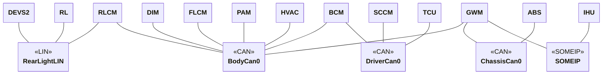

# RemotiveCar example

The purpose of the example is to show a somewhat realistic topology where multiple ECUs communicate over CAN, LIN and a SOME/IP network. This includes:

- `BehavioralModel` in python
- `ECUMock`
- Testcases with pytest
- Testcases with behave
- Jupyter notebook
- CAN communication over UDP or CAN
- SOME/IP
- Android emulator
- How to structure a more complex topology

Notice while the example is showing ECUs possible present in a real vehicle, the signals and implementations are simplified to make the example easy to understand. The goal is not intended to be fully realistic.

## Host setup
On Linux, this example requires that you run `dockercan` service on your machine to enable CAN networks in Docker, install the latest version from [here](https://releases.remotivelabs.com/#docker_can/) or read about how to do this over udp in the [documentation](https://docs.remotivelabs.com/docs/remotive-topology/getting-started#can).

## Project structure
Below is an overview of the project's directory layout and its main components:
```
common/
instances/
models/
platform/
tests/
```

### Common
The [common](common) directory contains shared components that can be used across different instances.

#### Jupyter notebook
Jupyter allows you to interact with the input ECUs using a graphical interface. In this example we include it in the main instance and start it by adding `--profile jupyter` as argument to docker compose. See more about how it is instantiated [here](instances/hello_world/README.md).

### Instances
The [instances](instances) directory contains different deployment configurations for the platform. These are used to start different subsets of the platform.

These instances serve as the input sources from which the final system setup is generated. They are commonly called `main.instance.yaml`.

The example contains two main instance
> :link: [RemotiveCar Hello World instance](instances/hello_world/README.md)<br>
> :link: [Instance with android emulator](instances/android/README.md)<br>


The hello world instance is the most suitable starting point and the instance with android emulator shows how to integrate a topology with the android emulator.

### Models (ECU implementation)
The [models](models) directory contains multiple implementations of ECUs. The most simple instance of these ECUs is [python_models.instance.yaml](models/python_models.instance.yaml) where each ECU uses a simple `BehavioralModel`.

Each model specifies how it should be instantiated from the main instance, and these definitions are used to generate the final output.

#### Running unit tests
It is important to test early, and local unit/integration tests are important tools to achieve this. As each python model is its separate package it is easy to write unit tests. For the a bit mor complicated model `BCM` there is tests located here [models/bcm/python/tests](models/bcm/python/tests).
The `BCM` python project uses `uv`, see installation [here](https://docs.astral.sh/uv/getting-started/installation/) or simply do
```bash
pip install uv
```

Run the unit tests from `remotive_car/models/bcm/python/bcm` folder.
First do
```bash
uv sync
```

Then run
```bash
uv run poe test
```

### Platform
The [platform](platform) directory defines the vehicle architecture and communication setup.

### Platform overview

The platform is defined in [remotive-car.platform.yaml](platform/remotive-car.platform.yaml) and the diagram and table below describes the components in the platform on a high level.



| ECU  | Name                           | Description                                             |
| ---- | ------------------------------ | ------------------------------------------------------- |
| ABS | Anti-lock Braking System        | Provides speed                                   |
| BCM  | Body Control Module            | Controls vehicle body electronics (lights, locks, etc.) |
| DEVS2  | | |
| DIM  | Driver Information Module      | Manages instrument cluster and driver displays          |
| FLCM | Front Light Control Module     | Controls front lighting system                          |
| GWM  | Gateway Module                 | Routes communication between different vehicle networks |
| HVAC | Heating, Ventilation, and Air Conditioning | Receives temperature control from Android infotainment.   |
| IHU  | Infotainment Head Unit         | Manages infotainment and user interface systems         |
| PAM | Parking Assistant Module | Provides access to proximity sensor values |
| RL | Rear Light       | Provides access to the rear light                                   |
| RLCM | Rear Light Control Module      | Controls rear lighting system                           |
| SCCM | Steering Column Control Module | Receives input from steering wheel, pedals and buttons  |
| TCU | Telematics Control Unit       | Provides GNSS location                                   |

### Tests
The test suite is implemented using the RemotiveLabs ECU framework. The [tester.instance.yaml](tests/tester.instance.yaml) instance may be included by other main.instance.yaml files. It includes scenario based tests using Behave + Gherkin and test cases using pytest.

Example usage is shown in [instances/hello_world/README.md](instances/hello_world/README.md)


## Available instances
Start an instance of the platform using RemotiveTopology. Here is a list of available instances
> :link: [Simple interactive instance](instances/hello_world/README.md)<br>
> :link: [Instance with android emulator](instances/android/README.md)<br>
