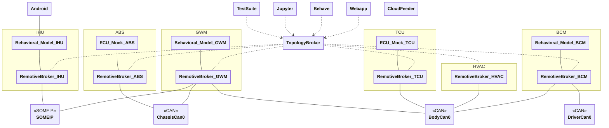
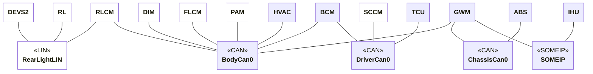

# Android instance

> This demo is still being improved, please reach out if you have issues or questions. mailto:support@remotivelabs.com, alternatively book a slot via: <https://www.remotivelabs.com/contact>


This demo shows bidirectional communication with Android. The goal is for you to be be able to follow a recorded drive through Android and observe the location and speed. You can also adjust the temperature in the Android UI and see that the signals are passed back into the topology.

- IHU connected over SOME/IP running Android with live location source

Notice while the example is showing ECUs possible present in a real vehicle, the signals and implementations are simplified to make the example easy to understand. The goal is not intended to be fully realistic.

## Instance overview

[main.instance.yaml](main.instance.yaml) describes the instance as shown in the diagram below.



Where we can see that the IHU is connected to the android emulator.

### Platform reference

[../../platform/remotive-car.platform.yaml](../../platform/remotive-car.platform.yaml) describes the platform to which all instances refer. In this android instance only blue parts are partcipants [main.instance.yaml](main.instance.yaml).



## Host setup

You will need the following tools

- `RemotiveCLI` <https://docs.remotivelabs.com/docs/remotive-cli/installation>
- `RemotiveTopology` <https://docs.remotivelabs.com/docs/remotive-topology/install>
- On Linux, this example requires that you run `dockercan` service on your machine to enable CAN networks in Docker, install the latest version from [here](https://releases.remotivelabs.com/#docker_can/). Alternatively include [can_over_udp.instance.yaml](../can_over_udp.instance.yaml) in your instance, as shown in the examples below.
- (Optional) `socat` [See Emulator on host](#emulator-on-host)
- (Optional) `Android-Studio` [See Emulator on host](#emulator-on-host)

Select you recording you like to use as input, navigate to it and extract the session id from the recording url <https://console.cloud.remotivelabs.com/p/my-demo/recordings/9459066702917749000?tab=playback>
Make sure the recording contains `ChassisBus` and `VehicleBus`
e.g. `9459066702917749000` also take note of the project (in this case `my-demo` which is the name which contains "Recordings").

> :warning: Unless already signed in start by doing `remotive cloud auth login`

## Getting started

The example can be run either using an Android emulator or a Cuttlefish instance. The emulator can be run either on the host machine or within docker and the Cuttlefish instance can be run within the docker environment. The easiest way to get started is by running the emulator within docker as it requires far less setup. For running the emulator on the host the instructions will differ based on your platform.

> :warning: When running Cuttlefish or the emulator within Docker it requires hardware virtualization using KVM to achieve any reasonable performance. This means that running the example in this configuration is limited to Linux only using x86_64 architecture.

#### Configuration

All configuration is done using RemotiveTopology instance files:

> :link: [Main instance](main.instance.yaml)<br>
> :link: [CAN over UDP](../can_over_udp.instance.yaml)<br>

Notice how the main instance includes other instance configuration files and also the platform configuration. RemotiveTopology is based around a modular approach to describe both platforms and different ways to instantiate them. For example in this example you can see how the IHU model is specifically built for this example, as it integrates towards android, by including [android.instance.yaml](../../models/ihu/android.instance.yaml).

### With Cuttlefish within Docker

The example is pre-configured with a Cuttlefish docker image that works with the topology. This image contains the reference Cuttlefish build for Android Automotive (Android 15). This does not contain any map application and since it does not contain Google Play APIs it will not work to install Google Maps manually. Instead pick another map application of your choice, for example <https://organicmaps.app/>. Place any APK you wish to install in `remotive_car/instances/android/cuttlefish/apks/` and it will be installed when the container starts.

#### Generate

Run one of the commands below, depending on your setup.

```bash
# Linux with DockerCAN
remotive-topology generate \
-f remotive_car/instances/android/main.instance.yaml \
-f remotive_car/instances/android/cuttlefish.instance.yaml \
remotive_car/build

# Linux with CAN over UDP
remotive-topology generate \
-f remotive_car/instances/android/main.instance.yaml \
-f remotive_car/instances/android/cuttlefish.instance.yaml \
-f remotive_car/instances/can_over_udp.instance.yaml \
remotive_car/build
```

RemotiveTopology uses Docker compose to define the containers and networks of the topology. Once generated, by following the steps in this section, it can be found [here](../../build/remotive_car_android/docker-compose.yml)

#### Run

Start the cloud playback, and start the topology, from the root of this repository.

```bash
# check above on how to extract you session id.
export CLOUD_URL=$(./remotive_car/instances/android/run.sh my-demo 9459066702917749000)
CLOUD_AUTH=$(remotive cloud auth print-access-token) \
docker compose -f remotive_car/build/remotive_car_android/docker-compose.yml \
-f remotive_car/instances/android/cuttlefish.compose.yaml \
--profile jupyter \
--profile ui \
--profile cloudfeeder up --build
```

You should then be able to reach the Cuttlefish instance by going to <https://localhost:1443>. The first time it starts you will have to configure some settings and permission for the maps application. If using the Organic Map you will also have to download maps for the areas you are interested in.

You can also visit the RemotiveBroker Webapp at <http://localhost:8080> to observe the temperature signals being send back from the Cuttlefish instance.

#### Tests

The Cuttlefish instance provides two tests located in `remotive_car/tests/pytest/android`. These will verify that location updates can flow from the TCU into Android and that HVAC changes in Android will flow back to the TCU. These can be run by running with the `tester` profile (and excluding the `cloudfeeder` profile).

```bash
docker compose -f remotive_car/build/remotive_car_android/docker-compose.yml \
-f remotive_car/instances/android/cuttlefish.compose.yaml \
--profile ui \
--profile tester up --build
```

The tests can also be run manually if you navigate to `remotive_car/tests/pytest` and run `uv run pytest -m android`.

### With emulator within Docker

To run the Google Maps application in the Android emulator it first needs to be installed. This is done during topology startup but it requires the APK to be provided during build. Download the APK, e.g. from <https://www.apkmirror.com/apk/google-inc/google-maps-android-automotive/>, and place it in the `remotive_car/instances/android/android_emulator` folder.

#### Generate

Run one of the commands below, depending on your setup.

```bash
# Linux with DockerCAN
remotive-topology generate \
-f remotive_car/instances/android/main.instance.yaml \
-f remotive_car/instances/android/android_emulator_in_docker.instance.yaml \
remotive_car/build

# Linux with CAN over UDP
remotive-topology generate \
-f remotive_car/instances/android/main.instance.yaml \
-f remotive_car/instances/android/android_emulator_in_docker.instance.yaml \
-f remotive_car/instances/can_over_udp.instance.yaml \
remotive_car/build
```

RemotiveTopology uses Docker compose to define the containers and networks of the topology. Once generated, by following the steps in this section, it can be found [here](../../build/remotive_car_android/docker-compose.yml)

#### Run

Start the cloud playback, and start the topology, from the root of this repository.

```bash
# check above on how to extract you session id.
export CLOUD_URL=$(./remotive_car/instances/android/run.sh my-demo 9459066702917749000)
CLOUD_AUTH=$(remotive cloud auth print-access-token) \
docker compose -f remotive_car/build/remotive_car_android/docker-compose.yml \
--profile jupyter \
--profile ui \
--profile cloudfeeder up --build
```

You should then be able to reach the emulator by going to <http://localhost:8085/vnc.html> and connecting. The first time it starts you will have to configure some settings and permission for the maps application.

You can also visit the RemotiveBroker Webapp at <http://localhost:8080> to observe the temperature signals being send back from the Android Emulator.

### With emulator on host

If you are not running on Linux or want more control of what to run within the emulator you can also use this example together with a local emulator, see [Emulator on host](EMULATOR_ON_HOST.md) on how to start the emulator.

#### Generate

Run one of the commands below, depending on your setup.

```bash
# Linux with DockerCAN
remotive-topology generate \
-f remotive_car/instances/android/main.instance.yaml \
-f remotive_car/instances/android/android_emulator_on_host.instance.yaml \
remotive_car/build

# Windows/MacOS CAN over UDP
remotive-topology generate \
-f remotive_car/instances/android/main.instance.yaml \
-f remotive_car/instances/android/android_emulator_on_host.instance.yaml \
-f remotive_car/instances/can_over_udp.instance.yaml remotive_car/build
```

RemotiveTopology uses Docker compose to define the containers and networks of the topology. Once generated, by following the steps in this section, it can be found [here](../../build/remotive_car_android/docker-compose.yml)

#### Run

Start the cloud playback, and start the topology, from the root of this repository.

```bash
# check above on how to extract you session id.
export CLOUD_URL=$(./remotive_car/instances/android/run.sh my-demo 9459066702917749000)
CLOUD_AUTH=$(remotive cloud auth print-access-token) \
ANDROID_EMULATOR_AUTH=$(cat ~/.emulator_console_auth_token) \
docker compose -f remotive_car/build/remotive_car_android/docker-compose.yml \
--profile jupyter \
--profile ui \
--profile cloudfeeder up --build
```

You can also visit the RemotiveBroker Webapp at <http://localhost:8080> to observe the temperature signals being send back from the Android Emulator.
