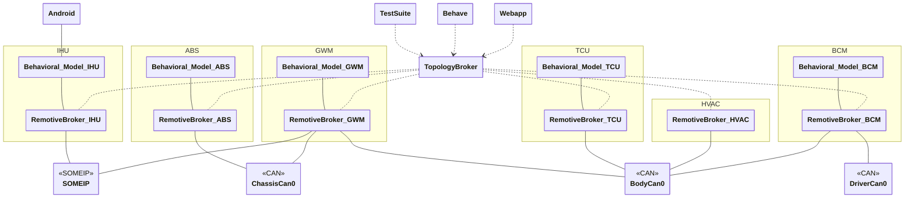
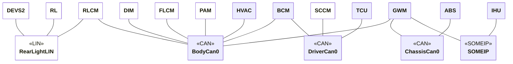

# Android instance

This demo shows bidirectional communication with Android. The goal is for you to be be able to follow a recorded drive through Android and observe the location and speed. You can also adjust the temperature in the Android UI and see that the signals are passed back into the topology.

- IHU connected over SOME/IP running Android with live location source

Notice while the example is showing ECUs possible present in a real vehicle, the signals and implementations are simplified to make the example easy to understand. The goal is not intended to be fully realistic.

## Instance overview

[main.instance.yaml](main.instance.yaml) describes the instance as shown in the diagram below.

```mermaid
---
config:
  class:
    hideEmptyMembersBox: true
---
    classDiagram
    namespace ABS {
        class Behavioral_Model_ABS
        class RemotiveBroker_ABS
    }

    namespace BCM {
        class Behavioral_Model_BCM
        class RemotiveBroker_BCM
    }

    namespace HVAC {
        class RemotiveBroker_HVAC
    }

    namespace GWM {
        class Behavioral_Model_GWM
        class RemotiveBroker_GWM
    }

    namespace TCU {
        class Behavioral_Model_TCU
        class RemotiveBroker_TCU
    }

    namespace IHU {
        class Behavioral_Model_IHU
        class RemotiveBroker_IHU
    }

    class ChassisCan0 {
        <<CAN>>
    }

    class BodyCan0 {
        <<CAN>>
    }

    class DriverCan0 {
        <<CAN>>
    }


    class SOMEIP {
        <<SOMEIP>>
    }


    class TopologyBroker
    class Android
    class TestSuite
    class Webapp
    class Behave

    RemotiveBroker_ABS -- ChassisCan0
    RemotiveBroker_GWM -- ChassisCan0

    RemotiveBroker_GWM -- BodyCan0
    RemotiveBroker_TCU -- BodyCan0
    RemotiveBroker_HVAC -- BodyCan0

    RemotiveBroker_BCM -- BodyCan0
    RemotiveBroker_BCM -- DriverCan0


    RemotiveBroker_IHU -- SOMEIP
    RemotiveBroker_GWM -- SOMEIP


    Behavioral_Model_ABS -- RemotiveBroker_ABS
    Behavioral_Model_BCM -- RemotiveBroker_BCM
    Behavioral_Model_GWM -- RemotiveBroker_GWM
    Behavioral_Model_TCU -- RemotiveBroker_TCU
    Behavioral_Model_IHU -- RemotiveBroker_IHU
    Android -- Behavioral_Model_IHU

    TestSuite ..> TopologyBroker
    Behave ..> TopologyBroker
    Webapp ..> TopologyBroker

    TopologyBroker .. RemotiveBroker_ABS
    TopologyBroker .. RemotiveBroker_BCM
    TopologyBroker .. RemotiveBroker_GWM
    TopologyBroker .. RemotiveBroker_HVAC
    TopologyBroker .. RemotiveBroker_IHU
    TopologyBroker .. RemotiveBroker_TCU
```

Where we can see that the IHU is connected to the android emulator.

### Platform reference

[../../platform/remotive-car.platform.yaml](../../platform/remotive-car.platform.yaml) describes the platform to which all instances refer. In this android instance only blue parts are partcipants [main.instance.yaml](main.instance.yaml).

```mermaid
---
config:
  class:
    hideEmptyMembersBox: true
---
    classDiagram

    class DEVS2 {
    }
    class DEVS2:::supress

    class RL {
    }
    class RL:::supress

    class RLCM {
    }
    class RLCM:::supress

    class DIM {
    }
    class DIM:::supress

    class FLCM {
    }
    class FLCM:::supress

    class HVAC {
    }

    class TCU {
    }

    class SCCM {
    }
    class SCCM:::supress

    class BCM {
    }

    class PAM {
    }
    class PAM:::supress

    class GWM {
    }

    class ABS {
    }

    class IHU {
    }

    class BodyCan0 {
        <<CAN>>
    }

    class DriverCan0 {
        <<CAN>>
    }

    class ChassisCan0 {
        <<CAN>>
    }

    class SOMEIP {
        <<SOMEIP>>
    }

    class RearLightLIN {
        <<LIN>>
    }
    class RearLightLIN:::supress

    DEVS2 -- RearLightLIN

    RL -- RearLightLIN

    RLCM -- RearLightLIN
    RLCM -- BodyCan0

    ABS -- ChassisCan0

    DIM -- BodyCan0

    FLCM -- BodyCan0

    PAM -- BodyCan0

    HVAC -- BodyCan0

    BCM -- BodyCan0
    BCM -- DriverCan0

    GWM -- BodyCan0
    GWM -- ChassisCan0
    GWM -- SOMEIP

    IHU -- SOMEIP

    SCCM -- DriverCan0

    TCU -- DriverCan0

    classDef supress fill:#ffffffff
```

## Host setup

You will need the following tools

- `RemotiveCLI` <https://docs.remotivelabs.com/docs/remotive-cli/installation>
- `RemotiveTopology` <https://docs.remotivelabs.com/docs/remotive-topology/install>
- On Linux, this example requires that you run `RemotiveBus` service on your machine to enable CAN and VLAN networks in Docker, see installation instructions [here](https://docs.remotivelabs.com/docs/remotive-bus/install). Alternatively include [can_over_udp.instance.yaml](../../settings/can_over_udp.settings.instance.yaml) and [vlan_using_bridge.settings.instance.yaml](../../settings/vlan_using_bridge.settings.instance.yaml) in your instance, as shown in the examples below.
- `git lfs` <https://git-lfs.com/> make sure to do `git lfs pull` if `git lfs` wasn't installed during `git clone`. For Ubuntu `sudo apt install git-lfs`.
- (Optional) `socat` [See Emulator on host](EMULATOR_ON_HOST.md)
- (Optional) `Android-Studio` [See Emulator on host](EMULATOR_ON_HOST.md)

## Getting started

The example can be run either using an Android emulator or a Cuttlefish instance. The emulator can be run either on the host machine or within docker and the Cuttlefish instance can be run within the docker environment. Cuttlefish comes in two variants: [cuttlefish.instance.yaml](cuttlefish.instance.yaml) uses an Android 16 image with built-in SOME/IP support where the Cuttlefish container is the IHU ECU, and [cuttlefish_vhal_grpc.instance.yaml](cuttlefish_vhal_grpc.instance.yaml) uses an Android 15 image where the IHU behavioral model bridges SOME/IP to Cuttlefish over VHAL gRPC, which needs no changes to the Android build. The easiest way to get started is by running the emulator within docker as it requires far less setup. For running the emulator on the host the instructions will differ based on your platform.

> :warning: When running Cuttlefish or the emulator within Docker it requires hardware virtualization using KVM to achieve any reasonable performance. This means that running the example in this configuration is limited to Linux only using x86_64 architecture.

#### Configuration

All configuration is done using RemotiveTopology instance files:

> :link: [Main instance](main.instance.yaml) 
> :link: [CAN over UDP](../../settings/can_over_udp.settings.instance.yaml) 
> :link: [VLAN using bridge](../../settings/vlan_using_bridge.settings.instance.yaml) 

Notice how the main instance includes other instance configuration files and also the platform configuration. RemotiveTopology is based around a modular approach to describe both platforms and different ways to instantiate them. For example in this example you can see how the IHU model is specifically built for this example, as it integrates towards android, by including [ihu.android_emulator.instance.yaml](../../models/ihu.android_emulator.instance.yaml) or [ihu.cuttlefish.instance.yaml](../../models/ihu.cuttlefish.instance.yaml).

### Use cases

[Cuttlefish](../../../usecases/ANDROID_CUTTLEFISH.md)
[Emulator](../../../usecases/ANDROID_EMULATOR.md)

### Troubleshoot

This guide presents deployment on various operating systems, but Linux is the preferred host operating system.
- Playback is not operational: Make sure you have `git lfs` installed, [see Host setup](#host-setup).
