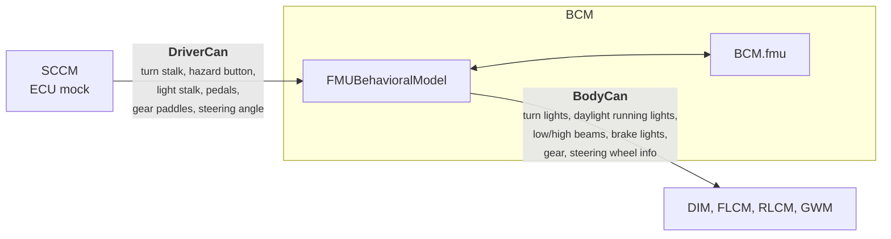

# RemotiveCar FMU instance

This instance is the same topology as the [hello world instance](../hello_world/README.md), except that the `BCM` is a
**Functional Mock-up Unit (FMU)** instead of a python behavioral model. The FMU implements the FMI 3.0 standard and is
stepped by RemotiveTopology, which feeds it CAN signals and puts its outputs back on the bus.

Everything else in the topology is unchanged, so this instance is a good way to see how an FMU replaces a hand written
model without any of the surrounding ECUs knowing about it.

> :link: [main.instance.yaml](main.instance.yaml)<br>
> :link: [bcm.fmu.instance.yaml](../../models/bcm.fmu.instance.yaml) - the BCM running the FMU<br>
> :link: [bcm.bm.instance.yaml](../../models/bcm.bm.instance.yaml) - the BCM running the python model, for comparison

## How the FMU is connected to the buses



The model is a small python wrapper, [models/bcm/fmu/bcm/\_\_main\_\_.py](../../models/bcm/fmu/bcm/__main__.py), that does
three things:

1. `INPUT_MAPPING` declares which `DriverCan` signal feeds which FMU input variable. `FMUBehavioralModel` subscribes to
   those frames and writes the signal values into the FMU.
2. `FMUSimulation` steps the FMU at the step size declared by the FMU itself (50 ms).
3. `on_output` publishes the FMU output variables as `BodyCan` signals on the restbus after every step.

### FMU interface

| FMU variable | Type | Direction | CAN signal |
|---|---|---|---|
| `turn_stalk` | `Int32` | input | `TurnStalk.TurnSignal` |
| `hazard_button` | `Int32` | input | `HazardLightButton.HazardLightButton` |
| `light_stalk_mode` | `Int32` | input | `LightStalk.LightMode` |
| `light_stalk_high_beam` | `Int32` | input | `LightStalk.HighBeam` |
| `brake_pedal_position` | `Int32` | input | `BrakePedalPositionSensor.BrakePedalPosition` |
| `accelerator_pedal_position` | `Int32` | input | `AcceleratorPedalPositionSensor.AcceleratorPedalPosition` |
| `shift_up_button` | `Int32` | input | `GearShiftPaddles.GearShiftUp` |
| `shift_down_button` | `Int32` | input | `GearShiftPaddles.GearShiftDown` |
| `steering_wheel` | `Float64` | input | `SteeringAngle.SteeringAngle` |
| `left_turn_light` / `right_turn_light` | `Boolean` | output | `TurnLightControl.*TurnLightRequest` |
| `left_daylight_light` / `right_daylight_light` | `Boolean` | output | `DaylightRunningLightControl.*DaylightRunningLightRequest` |
| `left_lowbeam` / `right_lowbeam` | `Boolean` | output | `LowBeamLightControl.*LowBeamLightRequest` |
| `left_highbeam` / `right_highbeam` | `Boolean` | output | `HighBeamLightControl.*HighBeamLightRequest` |
| `left_brake_light` / `right_brake_light` | `Boolean` | output | `BrakeLightControl.*BrakeLightRequest` |
| `accelerator_pedal_angle` | `Int32` | output | `AcceleratorPedalInfo.AcceleratorPedalPosition` |
| `gear_info` | `Int32` | output | `GearInfo.GearLeverPosition` |
| `steering_wheel_info` | `Float64` | output | `SteeringWheelInfo.SteeringWheelPosition` |
| `cycle_time` | `Float64` | parameter | - (blink cycle duration, default `0.7` s) |

## Host setup
- `RemotiveTopology` <https://docs.remotivelabs.com/docs/remotive-topology/install>
- On Linux, this example requires that you run `RemotiveBus` service on your machine to enable CAN and VLAN networks in
  Docker, see installation instructions [here](https://docs.remotivelabs.com/docs/remotive-bus/install). Alternatively
  include [can_over_udp.settings.instance.yaml](../../settings/can_over_udp.settings.instance.yaml) and
  [vlan_using_bridge.settings.instance.yaml](../../settings/vlan_using_bridge.settings.instance.yaml) in your instance,
  as shown below.

## Getting started
In order to run the commands in the sections below, first navigate to the root of this repository.

### Build
Run one of the commands below, depending on your setup.
```bash
# Linux with RemotiveBus
remotive topology build -f remotive_car/instances/fmu/main.instance.yaml remotive_car/build

# Windows/MacOS CAN over UDP
remotive topology build -f remotive_car/instances/fmu/main.instance.yaml -f remotive_car/settings/can_over_udp.settings.instance.yaml -f remotive_car/settings/vlan_using_bridge.settings.instance.yaml remotive_car/build
```

### Run
```bash
# Run Jupyter notebook
docker compose -f remotive_car/build/remotive_car_fmu/docker-compose.yml --profile jupyter up --build
```

Browse to [http://localhost:8888/lab?token=remotivelabs](http://localhost:8888/lab?token=remotivelabs) to drive the FMU
from the notebook, and use [RemotiveStudio](https://docs.remotivelabs.com/docs/remotive-studio) to view the signals it
produces.

### Test
```bash
# Run testsuite
docker compose -f remotive_car/build/remotive_car_fmu/docker-compose.yml --profile tester up --build --abort-on-container-exit
```

```bash
# Run the scenario based tests
docker compose -f remotive_car/build/remotive_car_fmu/docker-compose.yml --profile behave up --build --abort-on-container-exit
```

This instance runs the same [tests](../../tests) as the hello world instance, since the tests only use the CAN
interface of the `BCM` and not its implementation. The one exception is described below.

## Differences from the python BCM

- **Emergency mode is not implemented.** The python model handles a custom `emergency_mode` control request. The FMU
  only handles signals that are part of the platform and no custom control requests. The test that requires it is
  deselected by [tester_fmu.instance.yaml](../../tests/tester_fmu.instance.yaml). The
  `Emergency Mode` button in the Jupyter notebook does nothing in this instance.
