# RemotiveCar Hello World instance

[main.instance.yaml](main.instance.yaml) describes the instance as shown in the diagram below.

```mermaid
---
config:
  class:
    hideEmptyMembersBox: true
---
    classDiagram
    namespace ABS {
        class ECU_Mock_ABS
        class RemotiveBroker_ABS
    }

    namespace BCM {
        class Behavioral_Model_BCM
        class RemotiveBroker_BCM
    }

    namespace DIM {
        class RemotiveBroker_DIM
    }

    namespace FLCM {
        class RemotiveBroker_FLCM
    }

    namespace GWM {
        class Behavioral_Model_GWM
        class RemotiveBroker_GWM
    }

    namespace HVAC {
        class RemotiveBroker_HVAC
    }

    namespace IHU {
        class Behavioral_Model_IHU
        class RemotiveBroker_IHU
    }

    namespace PAM {
        class ECU_Mock_PAM
        class RemotiveBroker_PAM
    }

    namespace RL {
        class RemotiveBroker_RL
    }

    namespace RLCM {
        class Behavioral_Model_RLCM
        class RemotiveBroker_RLCM
    }

    namespace SCCM {
        class ECU_Mock_SCCM
        class RemotiveBroker_SCCM
    }

    namespace TCU {
        class ECU_Mock_TCU
        class RemotiveBroker_TCU
    }

    class BodyCan0 {
        <<CAN>>
    }

    class DriverCan0 {
        <<CAN>>
    }

    class ChassisCan0 {
        <<CAN>>
    }

    class SOMEIP {
        <<SOMEIP>>
    }

    class RearLightLIN {
        <<LIN>>
    }

    class TopologyBroker

    class TestSuite
    class Jupyter
    class Webapp
    class Behave

    RemotiveBroker_ABS -- ChassisCan0

    RemotiveBroker_BCM -- BodyCan0
    RemotiveBroker_BCM -- DriverCan0

    RemotiveBroker_DIM -- BodyCan0

    RemotiveBroker_FLCM -- BodyCan0

    RemotiveBroker_GWM -- BodyCan0
    RemotiveBroker_GWM -- ChassisCan0
    RemotiveBroker_GWM -- SOMEIP

    RemotiveBroker_HVAC -- BodyCan0

    RemotiveBroker_IHU -- SOMEIP

    RemotiveBroker_PAM -- BodyCan0

    RemotiveBroker_RL -- RearLightLIN

    RemotiveBroker_RLCM -- BodyCan0

    RemotiveBroker_SCCM -- DriverCan0

    RemotiveBroker_TCU -- BodyCan0

    Behavioral_Model_BCM -- RemotiveBroker_BCM
    Behavioral_Model_GWM -- RemotiveBroker_GWM
    Behavioral_Model_IHU -- RemotiveBroker_IHU
    Behavioral_Model_RLCM -- RemotiveBroker_RLCM
    ECU_Mock_ABS -- RemotiveBroker_ABS
    ECU_Mock_PAM -- RemotiveBroker_PAM
    ECU_Mock_SCCM -- RemotiveBroker_SCCM
    ECU_Mock_TCU -- RemotiveBroker_TCU

    TestSuite ..> TopologyBroker
    Jupyter ..> TopologyBroker
    Behave ..> TopologyBroker
    Webapp ..> TopologyBroker

    TopologyBroker .. RemotiveBroker_ABS
    TopologyBroker .. RemotiveBroker_BCM
    TopologyBroker .. RemotiveBroker_DIM
    TopologyBroker .. RemotiveBroker_FLCM
    TopologyBroker .. RemotiveBroker_GWM
    TopologyBroker .. RemotiveBroker_HVAC
    TopologyBroker .. RemotiveBroker_IHU
    TopologyBroker .. RemotiveBroker_PAM
    TopologyBroker .. RemotiveBroker_RL
    TopologyBroker .. RemotiveBroker_RLCM
    TopologyBroker .. RemotiveBroker_SCCM
    TopologyBroker .. RemotiveBroker_TCU
```



#### Brief description of the setup
- There are a total of 12 ECUs, 3 CAN buses, 1 LIN bus, 1 SOME/IP network and 1 control network.
- The business logic is centralized in the `BCM` ECU, using state machines to control the behavior of the lights.
- Inputs can either be simulated using a test suite, or by using a Jupyter notebook.
- Inputs:

  - steering wheel (wheel angle)
  - brake pedal
  - turn stalk (left/right)
  - light stalk (daylight running lights, low beams, high beams)
  - hazard button

- Outputs:

  - turn signal indicators
  - daylight running lights
  - high/low beams
  - brake lights

## Host setup
- `RemotiveTopology` <https://docs.remotivelabs.com/docs/remotive-topology/install>
- On Linux, this example requires that you run `dockercan` service on your machine to enable CAN networks in Docker, install the latest version from [here](https://releases.remotivelabs.com/#docker_can/). Alternatively include [can_over_udp.instance.yaml](../can_over_udp.instance.yaml) in your instance, as shown in the examples below.

## Getting started
In order to run the commands in the sections below, first navigate to the root of this repository.

### Generate
Run one of the commands below, depending on your setup.
```bash
# Linux with DockerCAN
remotive-topology generate -f remotive_car/instances/hello_world/main.instance.yaml remotive_car/build

# Windows/MacOS CAN over UDP
remotive-topology generate -f remotive_car/instances/hello_world/main.instance.yaml -f remotive_car/instances/can_over_udp.instance.yaml remotive_car/build
```

RemotiveTopology uses Docker compose to define the containers and networks of the topology. Once generated, by following the steps in this section, it can be found [here](../../build/remotive_car_hello_world/docker-compose.yml).

### Run
```bash
# Run Jupyter notebook + webapp
docker compose -f remotive_car/build/remotive_car_hello_world/docker-compose.yml --profile jupyter --profile ui up --build

# Run testsuite
docker compose -f remotive_car/build/remotive_car_hello_world/docker-compose.yml --profile tester up --build --abort-on-container-exit

# Run the scenario based tests
docker compose -f remotive_car/build/remotive_car_hello_world/docker-compose.yml --profile behave up --build --abort-on-container-exit
```

## Configuration
All configuration is done using RemotiveTopology instance files:

> :link: [Main instance](main.instance.yaml)<br>
> :link: [CAN over UDP](../can_over_udp.instance.yaml)

Notice how the main instance includes other instance configuration files and also the platform configuration. RemotiveTopology is based around a modular approach to describe both platforms and different ways to instantiate them. For example in this example you can see how the simple models are defined in a [reusable instance file](../../models/python_models.instance.yaml).

### Test
This instance includes the tests from [tester.instance.yaml](./../../tests/tester.instance.yaml), which contains both pytest and scenario based tests using behave. To run these you use the profile `tester` for pytest and `behave` for behave.

```bash
# Run testsuite
docker compose -f remotive_car/build/remotive_car_hello_world/docker-compose.yml --profile tester up --build --abort-on-container-exit

# Run the scenario based tests
docker compose -f remotive_car/build/remotive_car_hello_world/docker-compose.yml --profile behave up --build --abort-on-container-exit
```

#### Model unittest
It is important to test early, and local unit/integration tests are important tools to achieve this. As each python model is its separate package it is easy to write unit tests. For the a bit mor complicated model `BCM` there is tests located here [models/bcm/python/tests](../../models/bcm/python/tests).
The `BCM` python project uses `uv`, see installation [here](https://docs.astral.sh/uv/getting-started/installation/) or simply do
```bash
pip install uv
```

Run the unit tests from `remotive_car/models/bcm/python/bcm` folder.
First do
```bash
uv sync
```

Then run
```bash
uv run poe test
```

### Jupyter
This instance includes the jupyter instance from [jupyter.instance.yaml](../../common/jupyter/jupyter.instance.yaml). This allows you to interact with the input ECUs using a graphical interface. To start jupyter include the `jupyter` profile like:

```bash
docker compose -f remotive_car/build/remotive_car_hello_world/docker-compose.yml --profile jupyter up --build
```

and then browse to [http://localhost:8888/lab?token=remotivelabs](http://localhost:8888/lab?token=remotivelabs).

### RemotiveBroker Webapp
All the traffic moving through the busses can be observed with the Webapp. To start Webapp include the `ui` profile, this profile is always added by RemotiveTopology.

```bash
docker compose -f remotive_car/build/remotive_car_hello_world/docker-compose.yml --profile ui up --build
```

Browse to [http://localhost:8080](http://localhost:8080) and select the signals you like to monitor.
