# RemotiveCar Steering Wheel instance

[main.instance.yaml](main.instance.yaml) describes the instance as shown in the diagram below.

```mermaid
---
config:
  class:
    hideEmptyMembersBox: true
---
    classDiagram
    namespace ABS {
        class ECU_Mock_ABS
        class RemotiveBroker_ABS
    }

    namespace BCM {
        class Behavioral_Model_BCM
        class RemotiveBroker_BCM
    }

    namespace DIM {
        class RemotiveBroker_DIM
    }

    namespace FLCM {
        class RemotiveBroker_FLCM
    }

    namespace GWM {
        class Behavioral_Model_GWM
        class RemotiveBroker_GWM
    }

    namespace HVAC {
        class RemotiveBroker_HVAC
    }

    namespace IHU {
        class Behavioral_Model_IHU
        class RemotiveBroker_IHU
    }

    namespace PAM {
        class ECU_Mock_PAM
        class RemotiveBroker_PAM
    }

    namespace RL {
        class RemotiveBroker_RL
    }

    namespace RLCM {
        class Behavioral_Model_RLCM
        class RemotiveBroker_RLCM
    }

    namespace SCCM {
        class Behavioral_Model_SCCM
        class RemotiveBroker_SCCM
    }

    namespace TCU {
        class ECU_Mock_TCU
        class RemotiveBroker_TCU
    }

    class BodyCan0 {
        <<CAN>>
    }

    class DriverCan0 {
        <<CAN>>
    }

    class ChassisCan0 {
        <<CAN>>
    }

    class SOMEIP {
        <<SOMEIP>>
    }

    class RearLightLIN {
        <<LIN>>
    }

    class TopologyBroker

    class Jupyter
    class Webapp
    class RemotiveCar

    RemotiveBroker_ABS -- ChassisCan0

    RemotiveBroker_BCM -- BodyCan0
    RemotiveBroker_BCM -- DriverCan0

    RemotiveBroker_DIM -- BodyCan0

    RemotiveBroker_FLCM -- BodyCan0

    RemotiveBroker_GWM -- BodyCan0
    RemotiveBroker_GWM -- ChassisCan0
    RemotiveBroker_GWM -- SOMEIP

    RemotiveBroker_HVAC -- BodyCan0

    RemotiveBroker_IHU -- SOMEIP

    RemotiveBroker_PAM -- BodyCan0

    RemotiveBroker_RL -- RearLightLIN

    RemotiveBroker_RLCM -- BodyCan0

    RemotiveBroker_SCCM -- DriverCan0

    RemotiveBroker_TCU -- BodyCan0

    Behavioral_Model_BCM -- RemotiveBroker_BCM
    Behavioral_Model_GWM -- RemotiveBroker_GWM
    Behavioral_Model_IHU -- RemotiveBroker_IHU
    Behavioral_Model_RLCM -- RemotiveBroker_RLCM
    Behavioral_Model_SCCM -- RemotiveBroker_SCCM
    ECU_Mock_ABS -- RemotiveBroker_ABS
    ECU_Mock_PAM -- RemotiveBroker_PAM
    ECU_Mock_TCU -- RemotiveBroker_TCU

    TestSuite ..> TopologyBroker
    Jupyter ..> TopologyBroker
    Behave ..> TopologyBroker
    Webapp ..> TopologyBroker
    RemotiveCar ..> TopologyBroker
    RemotiveCar ..> RemotiveBroker_PAM
    RemotiveCar ..> RemotiveBroker_TCU

    TopologyBroker .. RemotiveBroker_ABS
    TopologyBroker .. RemotiveBroker_BCM
    TopologyBroker .. RemotiveBroker_DIM
    TopologyBroker .. RemotiveBroker_FLCM
    TopologyBroker .. RemotiveBroker_GWM
    TopologyBroker .. RemotiveBroker_HVAC
    TopologyBroker .. RemotiveBroker_IHU
    TopologyBroker .. RemotiveBroker_PAM
    TopologyBroker .. RemotiveBroker_RL
    TopologyBroker .. RemotiveBroker_RLCM
    TopologyBroker .. RemotiveBroker_SCCM
    TopologyBroker .. RemotiveBroker_TCU
```



#### Brief description of the setup

- There are a total of 12 ECUs, 3 CAN buses, 1 LIN bus, 1 SOME/IP network and 1 control network.
- The business logic is centralized in the `BCM` ECU, using state machines to control the behavior of the lights.
- Inputs originates from a physical steering wheel handled by the `SCCM` ECU (requires Linux `evdev` module)
- Inputs:

  - wheel angle
  - brake pedal
  - accelerator pedal
  - turn stalk (left/right)
  - light stalk (daylight running lights, low beams, high beams)
  - hazard button

- Outputs:

  - turn signal indicators
  - daylight running lights
  - high/low beams
  - brake lights
  - position (latitude and longitude)
  - vehicle speed (m/s)
  - proximity sensor values

## Host setup

- `RemotiveTopology` <https://docs.remotivelabs.com/docs/remotive-topology/install>
- `dockercan` to enable CAN networks in Docker; install the latest version from [here](https://releases.remotivelabs.com/#docker_can/).
  Alternatively include [can_over_udp.instance.yaml](../can_over_udp.instance.yaml) in your instance, as shown in the examples below.

Note! Only runs on Linux as the physical steering wheel requires the Linux `evdev` kernel module.

## Getting started

In order to run the commands in the sections below, first navigate to the root of this repository.

### Generate

```bash
remotive topology generate -f remotive_car/instances/steering_wheel/main.instance.yaml remotive_car/build
```

RemotiveTopology uses Docker compose to define the containers and networks of the topology.
Once generated, by following the steps in this section, it can be found [here](../../build/remotive_car_steering_wheel/docker-compose.yml).

### Generate with google maps

To run the Google Maps application in the Android emulator it first needs to be installed. This is done during topology startup but it requires the APK to be provided during build. Download the APK, e.g. from https://www.apkmirror.com/apk/google-inc/google-maps-android-automotive/, and place it in the remotive_car/instances/android/android_emulator folder.

```
remotive topology generate -f remotive_car/instances/steering_wheel/android.instance.yaml remotive_car/build
```

You should then be able to reach the emulator by going to http://localhost:8085/vnc.html and connecting. The first time it starts you will have to configure some settings and permission for the maps application.

### Run
```bash
# Run Jupyter notebook + webapp + remotivecar
docker compose -f remotive_car/build/remotive_car_steering_wheel/docker-compose.yml --profile jupyter --profile ui --profile remotivecar up --build
```

## Configuration

All configuration is done using RemotiveTopology instance files:

> :link: [Main instance](main.instance.yaml)<br>
> :link: [CAN over UDP](../can_over_udp.instance.yaml)

Notice how the main instance includes other instance configuration files and also the platform configuration
RemotiveTopology is based around a modular approach to describe both platforms and different ways to instantiate them.

### Jupyter

This instance includes the jupyter instance from [jupyter.instance.yaml](../../common/jupyter/jupyter.instance.yaml). This allows you to interact with the input ECUs using a graphical interface. To start jupyter include the `jupyter` profile like:

```bash
docker compose -f remotive_car/build/remotive_car_steering_wheel/docker-compose.yml --profile jupyter up --build
```

and then browse to [http://localhost:8888/lab?token=remotivelabs](http://localhost:8888/lab?token=remotivelabs).

### RemotiveBroker Webapp

All the traffic moving through the busses can be observed with the Webapp. To start Webapp include the `ui` profile, this profile is always added by RemotiveTopology.

```bash
docker compose -f remotive_car/build/remotive_car_steering_wheel/docker-compose.yml --profile ui up --build
```

Browse to [http://localhost:8080](http://localhost:8080) and select the signals you like to monitor.

### RemotiveCar

There is a simple 3D car model that can be used to visualize the driving experience:

```bash
docker compose -f remotive_car/build/remotive_car_steering_wheel/docker-compose.yml --profile remotivecar up --build
```

Browse to [http://localhost:8082](http://localhost:8082) and select the signals you like to monitor.
