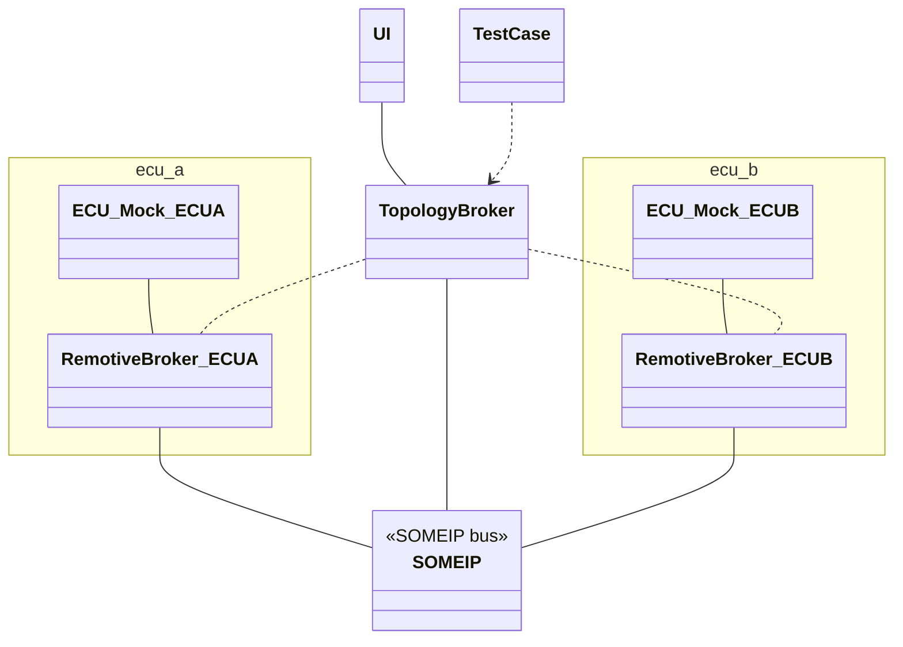

# SOME/IP example

The purpose of this example is to show more advanced SOME/IP usage, including RPC and more datatypes.

In this setup, `ECU A` emits events on a designated service ID using raw byte payloads. `ECU B` subscribes to the same event, capturing and logging the incoming raw data. Additionally, the web application is integrated into the system, allowing you to observe these events with.



## Configuration

### RemotiveBroker configuration

All ECUs can be found [here](./ecus).

#### Databases

Each ECU is configured with a fibex SOME/IP database.

### ECU configuration

`ECU A` is implementing a task which publishes SOME/IP events periodically and `ECU B` consumes these events and logs the incoming data.

### Topology Platform

This example uses a [Topology platform file](./topology/network.platform.yaml) where we configure a subnet (`10.0.2.0/24`) where the involved nodes communicate.

The SOME/IP traffic is not routed through the host, but it is still possible to view the raw packets using tcpdump `inside web-app-broker.com` container.

```bash
docker exec -it web-app-broker.com /bin/bash
```

Install tcpdump if it is the first time you run this.

```bash
apt-get install tcpdump
```

Run

```bash
tcpdump -i any -n udp port 30509 -XX
```

to observe port 30509.

Alternatively it is possible to run this on your computer, in that case don't open a shell in the container.

## Running

The commands below are used to build the topology and start the example, once it is running `ECU A` will emit random bytes from service `4660` on method `22136`.

You need to run this command from the root of the repository.

```bash
# build the topology
remotive-topology generate -f some_ip/topology/main.instance.yaml some_ip/build

# run the topology
docker compose -f some_ip/build/some_ip/docker-compose.yml up --build
```

### Pytest

We have implemented a test cases in [test_some_ip.py](./test/test_some_ip.py), which is a really simple showcase of a test case that ensures that both ECUs are started and retrieves the latest signal value sent from `ECU A` to `ECU B`.

The command below will start all ECUs, run the tests and exit with the exit code of the tests. You need to build your topology before running it (see above).

```bash
docker compose -f some_ip/build/some_ip/docker-compose.yml --profile tester up --build --exit-code-from tester
```

### Live bus monitoring using Remotive-web-app

All the traffic moving through the busses can be observed with the web-app. You can start it by running the topology with the `ui`profile:

```bash
docker compose -f some_ip/build/some_ip/docker-compose.yml --profile ui up --build
```

Browse to http://127.0.0.1:8080 and select the signals you like to monitor.
